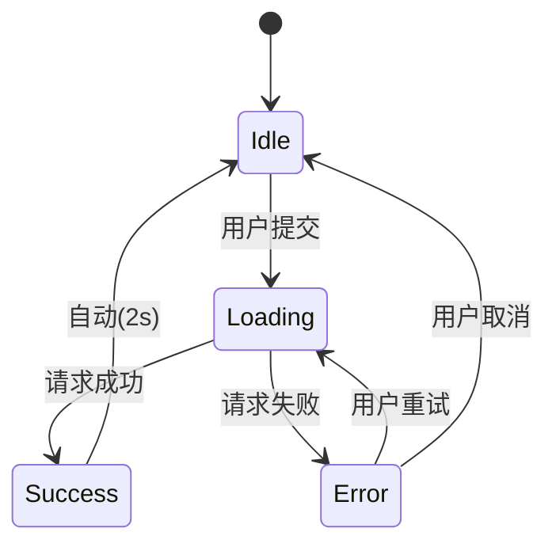
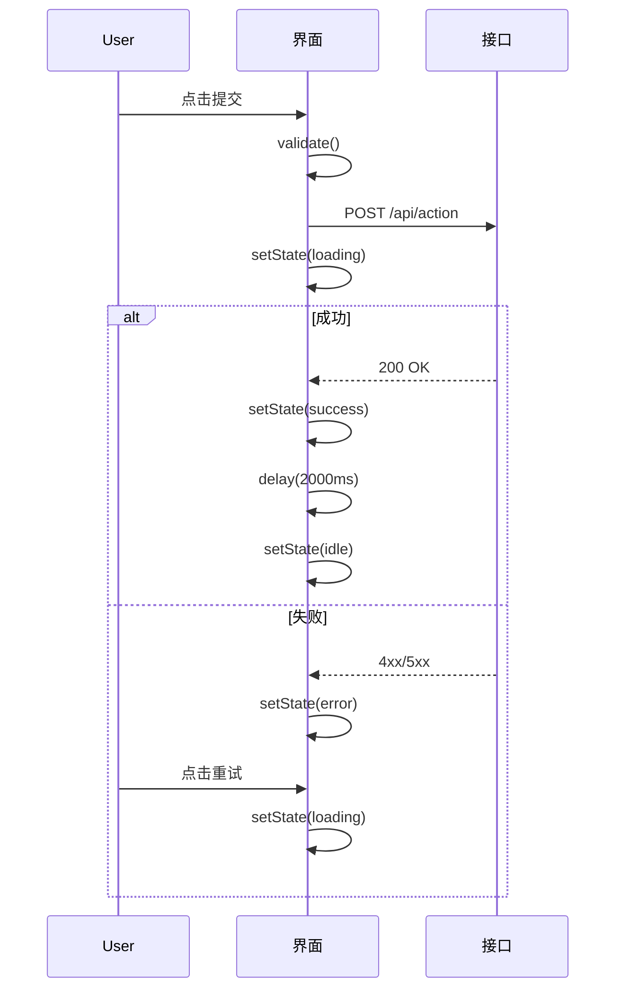
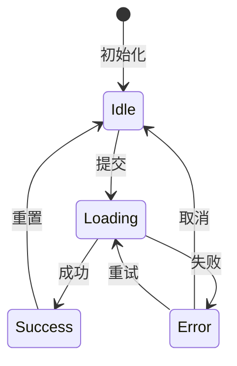
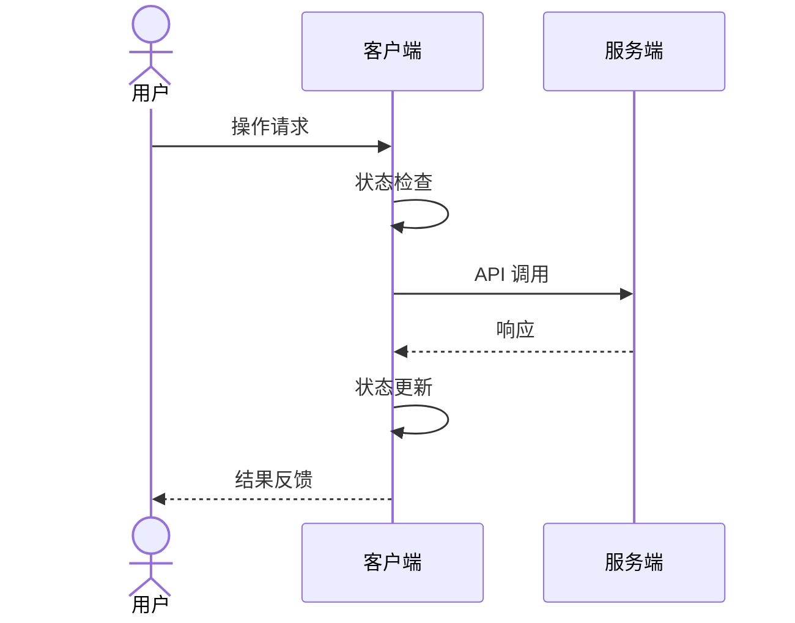
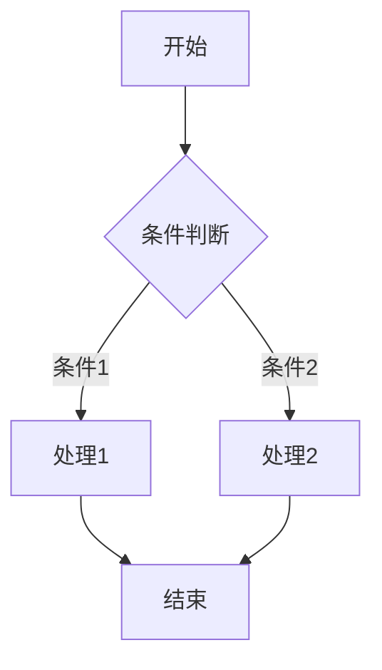

# 状态流设计

设计清晰、可维护的状态流转系统，用于复杂 UI 交互和业务流程。

---

## 何时使用状态流

**适合场景：**
- 多步骤用户流程（向导、表单、结账）
- 有明确状态的生命周期（会话、任务、订单）
- 需要状态机管理的复杂交互
- 需要文档化的用户操作流程

**不适用场景：**
- 简单的布尔状态切换
- 纯展示型组件
- 无状态的业务逻辑

---

## 状态流 vs 状态机

| 类型 | 用途 | 复杂度 |
|------|------|--------|
| **状态流** | 用户操作流程、业务过程 | 中 |
| **状态机** | 严格的状态转换、生命周期 | 高 |

**选择指南：**
- 用户操作流程 → 状态流
- 系统生命周期管理 → 状态机
- 两者可结合使用

---

## 状态流设计

### 基本结构

```markdown
## 状态流名称

### 目标
描述此状态流要实现的目标

### 参与者
- 用户：执行操作的人
- 系统：响应状态变化
- 外部服务：第三方交互

### 状态列表

| 状态 | 描述 | 入口条件 | 出口条件 |
|------|------|----------|----------|
| Idle | 空闲状态 | 初始化完成 | 用户触发操作 |
| Loading | 加载中 | 请求已发送 | 响应返回 |
| Success | 成功 | 响应成功 | 自动返回 Idle |
| Error | 错误 | 响应失败 | 用户重试/取消 |

### 状态转换图



### 交互细节

**Idle → Loading:**
- 触发：用户点击提交按钮
- 动作：发送请求，显示加载状态
- 验证：表单校验通过

**Loading → Success:**
- 触发：接口返回 200
- 动作：显示成功提示，更新数据
- 副作用：记录日志

**Loading → Error:**
- 触发：接口返回错误
- 动作：显示错误信息，保留表单数据
- 用户选项：重试或取消
```

### 文档模板

**默认落点：**
```
.agents/task-sessions/active/{session}.md
# 或相关 skill 的草稿区 / 决策记录
```

如果后续人类文档目录已重建，再把状态流整理回新的 `docs/` 结构。

**完整模板：**
```markdown
# {功能} 状态流

## 概述

**功能**: {一句话描述}
**范围**: {影响范围}
**优先级**: P{0-3}

## 状态定义

### 核心状态

| 状态 ID | 显示名称 | 描述 | 数据要求 |
|---------|----------|------|----------|
| idle | 空闲 | 等待用户操作 | - |
| loading | 加载中 | 正在处理请求 | requestId |
| success | 成功 | 操作完成 | result |
| error | 错误 | 处理失败 | errorCode, message |

### 子状态（可选）

| 父状态 | 子状态 | 描述 |
|--------|--------|------|
| loading | validating | 验证中 |
| loading | submitting | 提交中 |
| loading | processing | 处理中 |

## 状态转换

### 转换表

| 从状态 | 到状态 | 触发条件 | 前置检查 | 副作用 |
|--------|--------|----------|----------|--------|
| idle | loading | USER_SUBMIT | 表单有效 | 记录开始时间 |
| loading | success | API_SUCCESS | - | 记录耗时，刷新列表 |
| loading | error | API_ERROR | - | 记录错误日志 |
| error | loading | USER_RETRY | - | 增加重试计数 |
| * | idle | USER_CANCEL | - | 取消请求 |

### 转换约束

- 禁止从 success 直接到 loading（必须先经过 idle）
- 最大重试次数：3 次
- 超时自动转为 error 状态

## 时序图



## 实现参考

### 状态类型

```typescript
interface StateFlowState {
  status: 'idle' | 'loading' | 'success' | 'error';
  data?: ActionResult;
  error?: {
    code: string;
    message: string;
  };
  meta: {
    startTime?: number;
    retryCount: number;
  };
}
```

### 状态转换函数

```typescript
type StateTransition = 
  | { type: 'SUBMIT'; payload: FormData }
  | { type: 'SUCCESS'; payload: ActionResult }
  | { type: 'ERROR'; payload: ErrorInfo }
  | { type: 'RETRY' }
  | { type: 'RESET' };

function stateReducer(state: StateFlowState, action: StateTransition): StateFlowState {
  switch (action.type) {
    case 'SUBMIT':
      if (state.status !== 'idle') return state;
      return {
        ...state,
        status: 'loading',
        meta: { ...state.meta, startTime: Date.now() }
      };
    case 'SUCCESS':
      return {
        ...state,
        status: 'success',
        data: action.payload
      };
    // ...
  }
}
```

## 测试场景

| 场景 | 步骤 | 期望状态 |
|------|------|----------|
| 正常流程 | 提交 → 成功 | idle→loading→success→idle |
| 网络错误 | 提交 → 失败 → 重试 | idle→loading→error→loading→success |
| 超时 | 提交(超时) | idle→loading→error |
| 重复提交 | 快速点击两次 | 只触发一次请求 |
```

---

## 状态机设计

### 严格状态机

当需要严格的状态控制时使用：

```typescript
// 状态定义
enum SessionState {
  IDLE = 'idle',
  INITIALIZING = 'initializing',
  RUNNING = 'running',
  PAUSED = 'paused',
  COMPLETED = 'completed',
  FAILED = 'failed',
  CANCELLED = 'cancelled'
}

// 事件定义
enum SessionEvent {
  START = 'start',
  INIT_COMPLETE = 'init_complete',
  PAUSE = 'pause',
  RESUME = 'resume',
  COMPLETE = 'complete',
  FAIL = 'fail',
  CANCEL = 'cancel'
}

// 状态转换表
const TRANSITIONS: Record<SessionState, Record<SessionEvent, SessionState>> = {
  [SessionState.IDLE]: {
    [SessionEvent.START]: SessionState.INITIALIZING
  },
  [SessionState.INITIALIZING]: {
    [SessionEvent.INIT_COMPLETE]: SessionState.RUNNING,
    [SessionEvent.FAIL]: SessionState.FAILED,
    [SessionEvent.CANCEL]: SessionState.CANCELLED
  },
  [SessionState.RUNNING]: {
    [SessionEvent.PAUSE]: SessionState.PAUSED,
    [SessionEvent.COMPLETE]: SessionState.COMPLETED,
    [SessionEvent.FAIL]: SessionState.FAILED,
    [SessionEvent.CANCEL]: SessionState.CANCELLED
  },
  [SessionState.PAUSED]: {
    [SessionEvent.RESUME]: SessionState.RUNNING,
    [SessionEvent.CANCEL]: SessionState.CANCELLED
  },
  // 终止状态无转换
  [SessionState.COMPLETED]: {},
  [SessionState.FAILED]: {},
  [SessionState.CANCELLED]: {}
};

// 状态机类
class SessionStateMachine {
  private state: SessionState = SessionState.IDLE;
  
  canTransition(event: SessionEvent): boolean {
    return event in TRANSITIONS[this.state];
  }
  
  transition(event: SessionEvent): SessionState {
    if (!this.canTransition(event)) {
      throw new Error(
        `Invalid transition: ${this.state} -> ${event}`
      );
    }
    this.state = TRANSITIONS[this.state][event];
    return this.state;
  }
  
  getState(): SessionState {
    return this.state;
  }
}
```

---

## Mermaid 图表规范

### 状态图



### 时序图



### 流程图



---

## 实现模式

### React 状态流 Hook

```typescript
import { useReducer, useCallback } from 'react';

interface StateFlowConfig<S, E> {
  initialState: S;
  transitions: Record<S, Record<E, S>>;
  onTransition?: (from: S, to: S, event: E) => void;
}

function useStateFlow<S extends string, E extends string>(config: StateFlowConfig<S, E>) {
  const [state, dispatch] = useReducer(
    (state: S, event: E) => {
      const nextState = config.transitions[state]?.[event];
      if (!nextState) {
        console.warn(`Invalid transition: ${state} -> ${event}`);
        return state;
      }
      config.onTransition?.(state, nextState, event);
      return nextState;
    },
    config.initialState
  );

  const can = useCallback(
    (event: E) => event in (config.transitions[state] || {}),
    [state]
  );

  return { state, dispatch, can };
}

// 使用
const { state, dispatch, can } = useStateFlow({
  initialState: 'idle',
  transitions: {
    idle: { submit: 'loading' },
    loading: { success: 'success', error: 'error' },
    success: { reset: 'idle' },
    error: { retry: 'loading', cancel: 'idle' }
  }
});
```

---

## 快速检查清单

**设计状态流时：**
- [ ] 列出所有可能的状态
- [ ] 定义状态间的转换条件
- [ ] 绘制状态转换图
- [ ] 定义每个状态的进入/退出动作
- [ ] 考虑错误和边界情况

**实现状态流时：**
- [ ] 使用 TypeScript 定义状态类型
- [ ] 实现状态转换验证
- [ ] 处理无效转换
- [ ] 添加日志记录
- [ ] 编写状态流测试

**文档化状态流时：**
- [ ] 创建 Mermaid 图表
- [ ] 编写状态定义表
- [ ] 编写转换规则表
- [ ] 提供实现参考代码
- [ ] 列出测试场景

---

*清晰的状态流是复杂系统的骨架——它让不可预测变得可控。*
