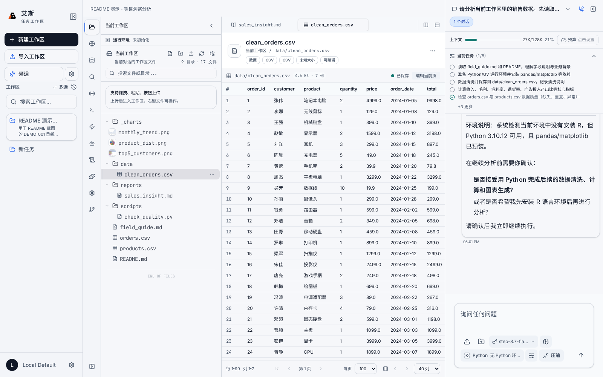
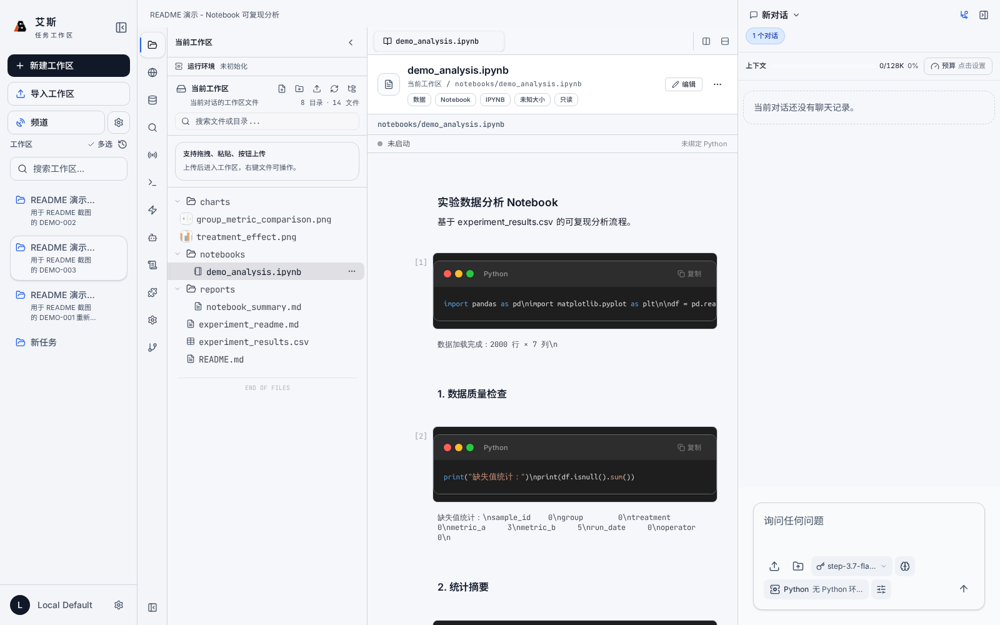
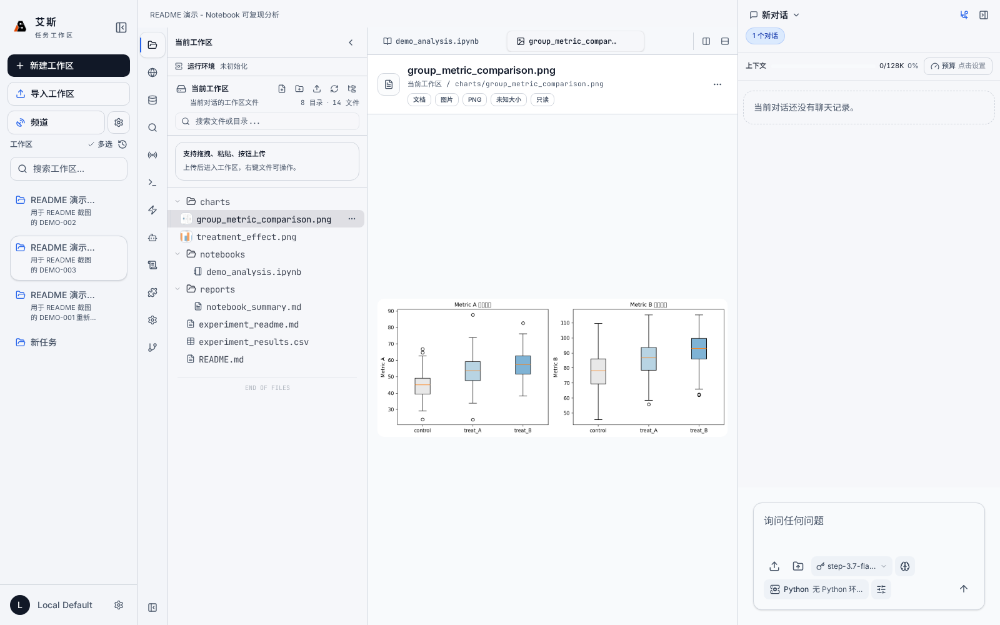
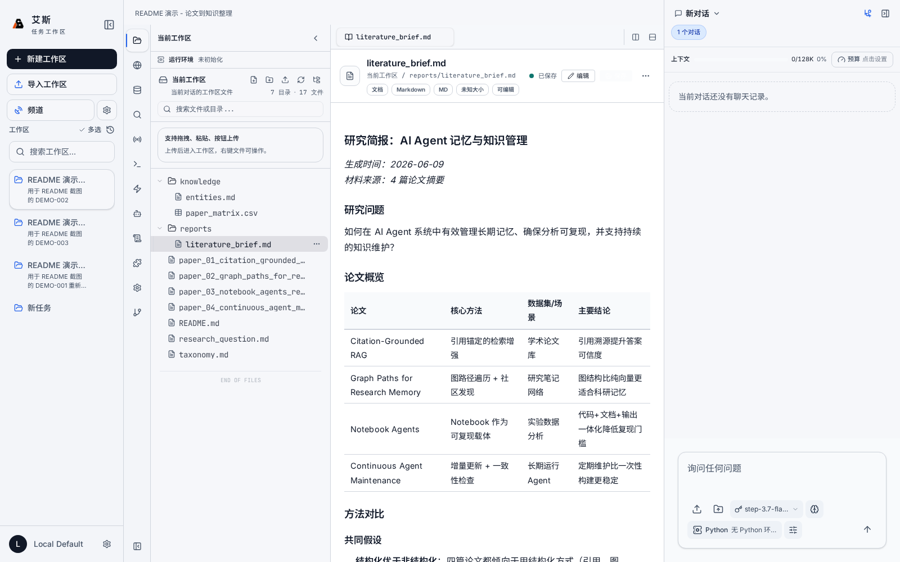
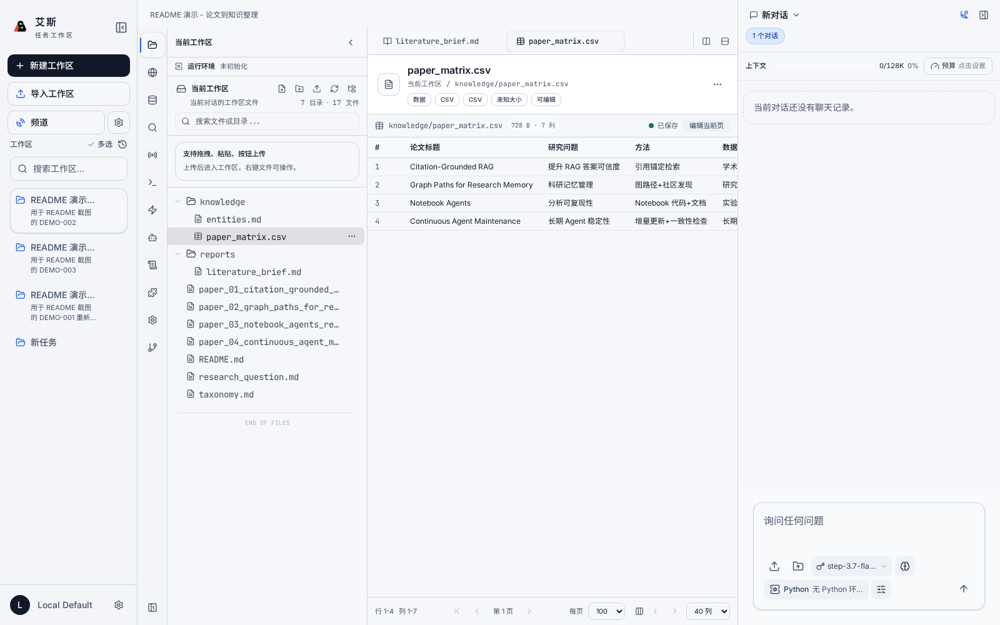
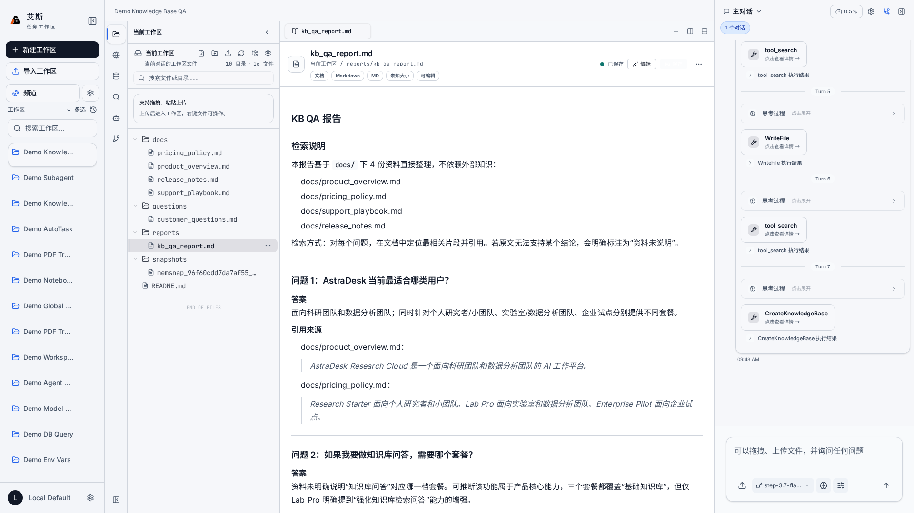
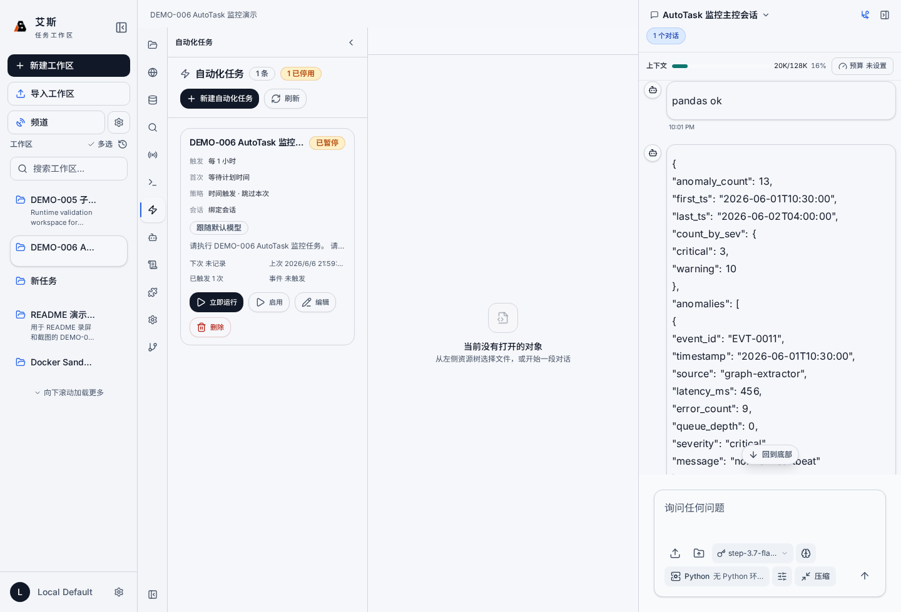
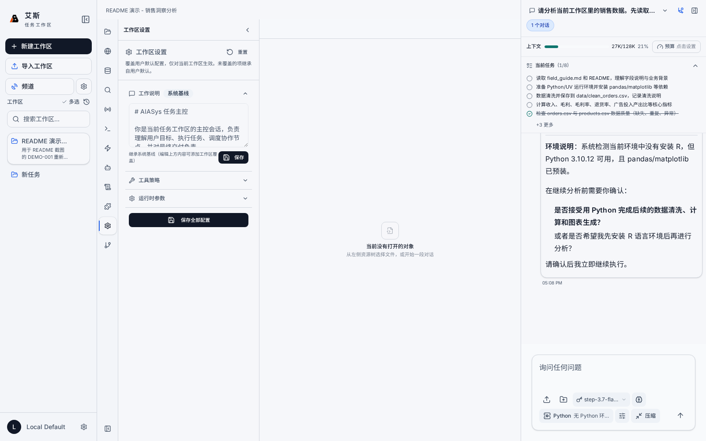

<p align="center">
  
</p>

<h3 align="center">AIASys — 以任务工作区为中心的 AI 工作台</h3>

<p align="center">v0.4.0</p>

<p align="center">
  <a href="./LICENSE">Apache 2.0</a>
</p>

---

## 这个项目解决什么问题

用 AI 工具推进复杂任务时，有一个问题反复出现：关闭浏览器之后，上一轮的上下文就丢了。文件散落在各个目录，实验结论记在聊天记录里，中间推导过程随着标签页关闭一起消失。下次继续同一个任务，得重新描述背景、重新上传资料、重新让 AI 理解你想干什么。

AIASys 的做法是把"任务"变成一个持久的工作区。文件、代码执行记录、知识库检索结果、对话都留在这个工作区里。关闭浏览器不影响任何东西，下次打开工作区，一切都在原地。

这和一般的 chatbot 式 AI 有本质区别。Chatbot 的交互模型是"一轮一问"，上下文在聊天记录里，关闭就丢，下次得重新描述背景。AIASys 的工作区是任务的持久载体，所有中间产物（文件、代码、数据、图表、知识库、图谱）都沉淀在工作区内，对话只是推进任务的一个入口，不是唯一的记忆载体。结果是可回看、可继续、可复用的，不是聊完就散的纯文本流。

不管你是做数据分析、跑实验、写论文，还是做 PPT、处理 Excel、写周报、整理文档，同一个工作区逻辑都适用。系统的内核是为科研和数据分析场景优化的（本地代码执行、混合检索、知识图谱、多维表格），但通用办公场景通过 MCP 市场和 Skill 市场接入外部能力后同样覆盖得很好。

工作区支持多会话。同一个任务可以同时走几条不同的思路，主线稳定推进，实验会话大胆尝试。会话之间共享文件系统，对话历史和执行状态各自独立。试错了就切回去，不用删东西重来。

默认走本地执行链路。代码在用户机器上跑，数据本地存储，文件系统直接映射。

AIASys 同时支持 Web 界面和桌面应用两种形态。桌面版基于 Electron 薄壳，是优先推荐的日常使用方式，有原生窗口、系统托盘和本地端口自动管理。Web 版适合临时访问和远程使用场景。桌面版目标支持 Windows、macOS、Linux 三端。

<p align="center">
  
</p>

AIASys 的核心链路围绕工作区展开。用户把任务、文件和目标放进工作区；Agent 读取当前会话、工作区和全局工作区上下文，通过默认工具、Skill、MCP 和 Python/Jupyter 运行环境推进任务；报告、图表、数据表、知识库、图谱和记忆再写回同一个工作区，后续会话可以继续使用。

<p align="center">
  
</p>

---

## 真实演示：从销售 CSV 到分析报告

下面这组素材来自一次真实执行的演示 case。Agent 读取 15015 行销售订单、产品表和字段说明，完成数据质量检查、去重、缺失值处理、指标计算、图表生成和报告撰写。最终交付物包括 `data/clean_orders.csv`、`reports/sales_insight.md` 和 4 张图表。

完整浏览视频：[demo-sales-walkthrough.mp4](images/readme/demo-sales-walkthrough.mp4)

<p align="center">
  
</p>

<p align="center">
  
</p>

<p align="center">
  
</p>

<p align="center">
  
</p>

更多演示用例在内部路径 `design-draft/demo-cases/cases/` 维护。这里按真实任务记录数据、推荐提示词、验收标准和运行指标。当前已初始化的重点用例包括知识库问答、知识图谱关系探索、Canvas 工作流画布、子 Agent 协作、AutoTask 触发监控和 PDF 翻译 Skill。README 只放已经跑通并有截图或录屏证据的素材，空状态截图和旧烟测截图不再作为对外展示图。

---

## 目前能做什么

创建工作区之后，可以在里面做这些事情：

**从模板创建工作区。** 系统内置 7 种工作区模板，覆盖空白起步、官方默认、代码开发、数据分析、论文精读、知识管理和竞赛攻关等场景。一键创建即可预置好文件结构、协作指南、示例代码和初始配置。也可以把当前工作区保存为自定义模板，下次遇到同类任务直接复用。

**写代码并执行。** 内置 Python Notebook 环境，基于 Jupyter 协议。Agent 编辑 cell、运行、看输出、继续改。所有执行记录留在工作区里，下次打开还能看到上次跑的结果。支持多个 Python 环境切换，系统里装了不同版本的 Python 或 conda 环境，注册之后在 Notebook 里就能选对应内核来执行。

<p align="center">
  
</p>

<p align="center">
  
</p>

**注入环境变量。** 支持全局和工作区两个级别的环境变量注入。全局变量对所有工作区生效（API Key、代理配置这类通用设置），工作区变量只对当前任务生效（数据库连接串、项目路径这类任务专属配置）。前端有面板直接管理，不需要手写配置文件。

**查知识库。** 上传 PDF、Markdown 等文档，系统自动分块、向量化、建全文索引。检索走混合排序（全文匹配 + 向量语义 + RRF 融合），并对向量结果应用多样性过滤，避免返回内容过于集中在单一主题。支持创建多个知识库，每个知识库独立管理自己的文档集和索引，不同任务用不同知识库，互不干扰。Agent 可以通过系统内置工具创建和更新知识库、上传文档、列出文档、删除文档、查询内容。知识库本身也是工作区里的一种资源文件，可以在侧栏里像打开文件一样预览和管理。

知识库能力也支持论文整理和文献综述场景。Agent 可以读取多篇论文材料，提取研究问题、方法、数据集和结论，生成结构化对比矩阵和综述报告，把知识沉淀为可查询的资产。

<p align="center">
  
</p>

<p align="center">
  
</p>

<p align="center">
  
</p>

**看知识图谱。** 工作区里的每个知识图谱对应一个独立的 SQLite 数据库文件，包含实体、关系、社区和图谱布局信息。前端读取图数据并渲染成可交互图谱。图谱工作台支持文件构图、文本构图、节点搜索、实体详情、邻接关系和图谱问答。Agent 也可以通过系统内置工具列出、创建、删除图谱，维护实体和关系，读取社区报告，并把工作区文档导入图谱构建实体关系。和知识库一样，图谱也是工作区资源文件，在侧栏里点击即可预览。

<p align="center">
  
</p>

**画布（Canvas）。** 支持 JSON Canvas 格式的无限画布文件，可以在工作区内直接打开、编辑和预览。Canvas 适合做头脑风暴、思路梳理、项目规划，在无限画布上拖放节点、连线关系、自由布局。Agent 可以通过系统内置工具读取、覆盖写入和批量修改 `.canvas` 文件；内置 Canvas Skill 则提供脚本化编辑和格式校验。

<p align="center">
  
</p>

**建多维表格。** 类似 Notion Database 的交互界面，定义字段类型、添加行、格子内直接编辑。每张表底层是 SQLite `.table.db` 文件，保存元数据、列定义和 records 表。Agent 可以通过系统内置工具创建表、读取 schema、读写记录、增删改列，适合做对比矩阵、实验记录、数据整理。

**查数据库。** 工作区里可以创建多个数据库文件用于数据分析，支持 SQLite 和 DuckDB 两种格式，根据文件扩展名自动识别引擎。也可以连接外部 PostgreSQL 等数据库。知识库、知识图谱、数据库和多维表格都按工作区资源文件管理，查询和检索结果可以纳入当前会话的对话上下文。

**接 MCP 和 Skill。** MCP 市场和 Skill 市场都支持搜索和浏览。你可以在市场中按关键词搜索想要的工具或领域 know-how，Agent 会帮你完成安装、配置和连接测试。MCP 扩展系统能力边界：接入 Office 相关 Server 就能处理 PPT、Excel、Word；接入通讯工具就能通过微信、飞书远程收发指令和通知；接入浏览器控制就能让 Agent 自己上网查资料。Skill 则提供数据分析、文档处理、研究探索等领域的 SOP 和脚本包，按需启用，不占用未使用时的上下文空间。系统内置了 AIASys 平台指南、竞赛研究、Skill 开发、arXiv 搜索、PDF 翻译、PDF 转 Markdown、PaddleOCR 文档提取和 Canvas 编辑等 Skill。

**派子 Agent 并行干活。** 复杂任务拆成子任务，分派给不同角色的 Agent 并行执行。主控 Agent 做协调，子 Agent 各自拥有独立的执行上下文，不会互相污染记忆。

**自动化任务。** AutoTask 统一承接目标推进和时间触发。可以创建连续推进、单次、周期和固定时间任务；可以绑定当前会话继续使用同一条上下文，也可以每次触发新建普通会话。连续推进会要求 Agent 做完成审计，目标达成时写回完成，达到轮次、连续错误或用户暂停时停止。会话预算由右侧预算入口控制，预算耗尽后对应会话会停止执行。

<p align="center">
  
</p>

**灵活配置模型。** 支持三种 LLM 接口协议（OpenAI Chat Completions、OpenAI Responses、Anthropic Messages），可接入市面上绝大多数模型提供商（kimi、DeepSeek、Qwen、GPT、Claude、Gemini、阶跃星辰 StepFun 等）。模型选择按三层作用域生效：全局默认、工作区优先、会话优先，粒度由粗到细。更细粒度上，不同任务环节可以指定不同模型：主控对话、上下文压缩、记忆整理、子 Agent 执行各自独立路由。比如主控用 Claude 做深度推理，子 Agent 用 Gemini Flash 做快速代码生成，压缩环节用轻量模型降低成本。前端配置面板统一管理，多提供商同时启用，切换即生效。

**终端。** 工作区内置 WebSocket 终端，直接连到工作区的文件系统。Agent 可以在终端里执行命令、运行脚本、管理环境。终端会话附着在当前工作区的工作目录上，和 Notebook 共享同一个文件系统。

**记忆系统。** 系统在工作区和会话层面维护长期记忆，会话启动时自动注入相关记忆摘要，Agent 据此了解任务背景和过往决策。用户也可以在前端面板手动管理记忆条目。

**上下文和预算可见。** 聊天区顶部显示当前会话的上下文占用、模型上下文窗口和会话级 token 预算。预算限制当前会话的累计消耗，普通对话和自动化任务都受同一上限约束；压缩上下文不会重置已经用掉的预算。

**中途确认。** Agent 在执行过程中遇到需要用户决策的节点，会主动暂停并通过弹窗询问。用户可以确认、拒绝或输入额外信息，Agent 拿到回复后继续执行。

**远程接入。** 通过 Claw 连接器接入微信、飞书等通讯平台。配置完成后，可以通过这些工具远程向 AIASys 派任务、接收执行通知。也支持扫码登录微信，Agent 可以收发消息。

**会话导出。** 会话的完整历史，包括对话记录、执行日志、生成的文件产物，可以打包导出为 bundle，用于归档、分享或迁移到其他工作区。

**Agent 配置。** 用户默认的 Agent Soul、工作区项目画像和当前会话覆盖项分层管理。Agent 执行前会读取这些配置，决定协作方式、表达风格、项目边界和本次任务的执行策略。

<p align="center">
  
</p>

**读图识图。** Agent 可以通过 ReadMedia 工具读取和分析图片内容。扔一张截图给它，它能理解画面里的 UI、图表、文字，然后据此做出响应。适合看图排查问题、根据设计稿写代码、分析图表数据等场景。

**PDF 翻译。** Agent 可以调用 PDF 翻译工具，把外文 PDF 文档翻译成中文。支持指定源语言和目标语言，翻译结果保留原文结构。

**执行检查点。** 会话执行过程中可以创建检查点，保存当前状态快照。后续可以回看检查点时的文件状态、对话上下文和执行进度。适合在关键决策点留档，出问题时回退对比。

**富文本聊天。** 聊天区支持 Markdown 渲染、ECharts 图表内嵌、数学公式（KaTeX）和代码语法高亮。Agent 的输出不只是纯文本，可以是一张交互式图表、一张对比表格、一段带公式的推导。还有流式思维块展示，Agent 思考过程实时可见。

**图片灯箱。** 聊天和文件预览中的图片支持点击放大，进入灯箱模式查看原图。适合查看高清截图、数据图表和大尺寸图片。

---

## 文件编辑与预览

工作区内的文件不只是存着，大部分可以直接在界面上编辑和预览。

### 可编辑文件

以下文件类型支持在工作区内直接编辑：

| 类别 | 文件类型 |
|------|---------|
| 文档 | `.md` `.markdown` `.mdx` `.txt` |
| 数据 | `.json` `.jsonl` `.yaml` `.yml` `.csv` `.tsv` `.xml` |
| 配置 | `.ini` `.conf` `.cfg` `.toml` `.properties` `.env` |
| 代码 | `.py` `.js` `.ts` `.tsx` `.jsx` `.html` `.css` `.scss` `.sql` |
| 脚本 | `.sh` `.bash` `.zsh` |
| 特殊 | `.ipynb`（Notebook）`.canvas`（画布） |

编辑器基于 CodeMirror，支持语法高亮、自动补全、多光标编辑。

### 可预览文件

除了编辑，更多文件类型支持在侧栏面板中直接预览：

| 预览类型 | 支持格式 |
|---------|---------|
| 图片 | PNG、JPG、GIF、SVG、WebP |
| 文档 | PDF、DOCX（Word）、PPTX（PowerPoint）、XLSX（Excel） |
| 数据 | CSV（表格视图）、SQLite/DuckDB 数据库文件 |
| Notebook | `.ipynb`（完整渲染） |
| 记忆 | 会话记忆条目预览 |

### 资源即文件

知识库、知识图谱、数据库、记忆、多维表格在 AIASys 里不只是"后台服务"，它们在侧栏里表现为资源节点，点击就能打开预览面板。知识库可以看文档列表和检索，图谱可以看节点关系图，数据库可以看表结构和查询，记忆可以看条目列表。这种设计让所有工作区资产都能在一个地方找到、打开、操作，不需要在不同页面之间来回跳。

---

## 左侧 Activity Bar：工作区导航

左侧图标栏承载了工作区的主要导航和功能入口，按功能拆成多个面板，支持拖拽排序：

| 图标 | 面板 | 功能 |
|------|------|------|
| 文件夹 | 当前工作区 | 当前工作区的文件浏览，拖拽上传、新建文件/文件夹、搜索和右键操作 |
| 地球 | 全局工作区 | 跨工作区共享的文件资源，全局知识库、数据库连接等 |
| 放大镜 | 文件搜索 | 全文检索工作区文件内容 |
| 数据库 | 数据查询 | 连接数据库执行 SQL，查看表和字段，结果可作为会话上下文 |
| 机器人 | 专家协作节点 | 查看多 Agent 并行执行流程和可视化执行树 |
| 闪电 | 自动化任务 | 管理连续推进、单次、周期和 Cron 任务 |
| 文档 | 环境变量 | 当前工作区的环境变量可视化编辑 |
| 拼图 | 能力管理 | MCP Server、Skill 和协作专家的管理与配置 |
| 齿轮 | 工作区设置 | 当前工作区的 Agent 配置：工作说明、工具策略、运行时参数 |
| 天线 | 监控任务 | Agent 运行时状态、后台任务和监听器状态监控 |
| 电脑 | 终端 | WebSocket 终端，直接连到工作区文件系统执行命令 |

用户可以根据使用习惯拖拽调整图标顺序，偏好会保存在用户设置中。

## 右侧聊天侧栏：对话与上下文

右侧侧栏（Conversation Dock）承载当前会话的对话和协作上下文，核心功能包括：

- **对话区**：当前会话的聊天，支持流式输出和 Markdown/图表/数学公式渲染
- **会话管理**：切换、新建、Fork、重命名和删除对话
- **执行状态**：聊天消息流中可查看子 Agent 任务的实时状态和执行记录；完整的执行树在左侧「专家协作节点」面板或中间画布 Tab 页中打开
- **输入区**：发送消息、上传附件，Agent 回复实时流式显示

侧栏宽度可拖拽调整，可以折叠以扩大中间画布区域。

---

## 目标用户和典型场景

AIASys 核心能力覆盖了从科研分析到日常办公的广泛场景。

### 数据分析师

工作区里挂上公司数据库和内部知识库，告诉 Agent "分析 Q3 销售趋势，对比 Q2，找出增长率最高的品类"。Agent 自己写 SQL、跑查询、画 ECharts 图表、检索知识库里的历史分析框架。

分析过程中发现有异常波动，Fork 一个新会话专门排查。主会话继续推进报告，排查会话独立调查根因。两个会话共享文件系统但对话上下文隔离。

结论和图表留工作区里，Q4 时拉到同一个工作区继续推进。环境变量面板里配置好数据库连接串，Agent 随时能查最新数据。

自动化任务设成"每天早上 8 点拉取昨日销售数据生成简报"，到点触发后记录事件。任务面板里能看到触发规则、上次运行、下次运行和异常状态。

### 科研人员

上传 50 篇论文 PDF 到知识库，Agent 自动分块、向量化、建索引。在多维表格里生成对比矩阵（方法、数据集、指标、结论），知识图谱可视化论文之间的引用关系。

开一个工作区做文献综述，利用多会话对比不同的综述角度。一个会话按方法维度组织，另一个会话按应用领域组织。两条会话跑完后对比结果，决定最终方向。

Notebook 里写分析代码，Agent 编辑 cell、跑结果、画图。多知识库的好处是不同类型文献分开管理：综述文献一个库、方法论文一个库、数据集论文一个库。查方法时不混入综述内容。

实验记录放在多维表格里，每次实验一行，字段包括参数、指标、备注。Agent 直接读写表格，生成对比分析。

### 独立开发者

工作区里有前端代码、后端 API、数据库设计。Agent 理解完整项目上下文，一次改动跨前端和后端。不同模块开不同会话试方案，跑通的合回主线。

在协作专家市场里启用"前端开发"和"后端开发"两个协作专家，复杂需求拆成前后端任务并行执行。主控 Agent 协调进度，用户在执行树上看到每个子 Agent 的实时状态。

代码编辑器基于 CodeMirror，语法高亮和自动补全。Notebook 里跑测试和调试脚本，多个 Python 环境随时切换。终端直接连工作区文件系统，Agent 可以在终端里执行构建命令、安装依赖、运行脚本。

全局工作区里放公共配置文件、复用脚本、API 文档模板，所有项目工作区都能访问。项目专属的配置和密钥放工作区环境变量里。

### 普通办公人群

接入 Office MCP 后，Agent 直接读写 PPT、Excel、Word 文件。一句话"把这个 Excel 的销售数据整理成汇总表，再生成一份 PPT，第一页放总览，后面按品类拆"，Agent 自己打开文件、分析数据、生成结果。

接入浏览器控制 MCP 后，Agent 自己上网查资料、填表单、采集数据。用户说"帮我查一下这几个竞品的最新融资情况"就行。

接入飞书或微信的 MCP 后，通过聊天工具远程给 Agent 派任务。在外面想到需要查个数据，发条微信，Agent 在工作区里执行后把结果发回来。

日常文档管理：所有工作文件放在"日常办公"工作区里，知识库里建一个"公司文档"索引。Agent 能根据文档内容回答各种政策、流程、规范问题。

### 更多可能性

MCP 市场和 Skill 市场的生态决定了系统能力没有固定上限。新的 MCP Server 接入新的数据源和工具，新的 Skill 注入新的领域 know-how。上面的场景只是当前能力的一个截面。随着市场生态的扩展，AIASys 能覆盖的工作场景会继续增加。

---

## 技术栈和项目结构

<table>
<tr><th width="140">层级</th><th>技术</th></tr>
<tr><td>后端框架</td><td>Python 3.12, FastAPI, Pydantic v2</td></tr>
<tr><td>Agent 引擎</td><td>自研 Agent Runtime, FastMCP</td></tr>
<tr><td>ORM</td><td>SQLAlchemy</td></tr>
<tr><td>前端</td><td>React 19, TypeScript, Vite</td></tr>
<tr><td>UI</td><td>Tailwind CSS 4, shadcn/ui, Pixi.js + d3-force</td></tr>
<tr><td>文件数据库</td><td>SQLite, DuckDB</td></tr>
<tr><td>向量存储</td><td>SQLite + sqlite-vec</td></tr>
<tr><td>全文检索</td><td>SQLite FTS5 + jieba 分词</td></tr>
<tr><td>代码执行</td><td>本地 Jupyter 内核</td></tr>
<tr><td>桌面壳</td><td>Electron</td></tr>
<tr><td>文件编辑器</td><td>CodeMirror 6</td></tr>
<tr><td>基础设施</td><td>Docker, Nginx</td></tr>
</table>

```
AIASys/
├── apps/
│   ├── backend/              # FastAPI 后端
│   │   ├── app/
│   │   │   ├── api/routes/   # 路由模块
│   │   │   ├── agents/tools/ # Agent 内置工具
│   │   │   ├── models/       # SQLAlchemy 数据模型
│   │   │   └── services/     # 业务服务层
│   │   └── tests/
│   ├── web/                  # React 前端
│   │   └── src/
│   │       ├── components/   # 组件
│   │       ├── pages/        # 页面
│   │       └── hooks/
│   └── desktop/              # Electron 桌面壳
├── docs/                     # 用户文档
├── infra/                    # Docker + Nginx 部署
└── scripts/                  # 项目级工具脚本
```

---

## 跑起来

需要 Python 3.12+、Node.js 22+。内置文件数据库使用 SQLite 和 DuckDB，外部 PostgreSQL 等数据库可以通过连接器接入。开发和桌面运行目标覆盖 Windows、macOS、Linux。

```bash
# 装依赖
cd apps/web && npm ci
cd ../backend && uv sync

# 准备配置
[ -f config.json ] || cp config.example.json config.json
# 编辑 config.json，填 LLM API Key 和 Embedding API Key

# 起后端
cd apps/backend
export ENCRYPTION_KEY="your-secret-key"
.venv/bin/uvicorn app.main:app --host 0.0.0.0 --port 13001

# 起前端（另一个终端）
cd apps/web
npm run dev -- --host 0.0.0.0 --port 13000
```

打开 `http://localhost:13000/workspace`，新建工作区，在左侧 Activity Bar 选择功能面板开始使用，右侧聊天侧栏输入第一个问题和 Agent 对话。

也可以用根目录的 `./dev.sh` 同时拉起前后端。

桌面应用（推荐日常使用）：

```bash
cd apps/desktop && npm install && npm run dev
```

桌面版自动复用已运行的 backend/frontend，未运行时自动拉起，并打开 Electron 窗口。

常用命令：

```bash
cd apps/backend && uv run pytest          # 后端测试
cd apps/web && npm run test:e2e:lifecycle # 前端端到端测试
cd apps/backend && .venv/bin/uvicorn app.main:app --host 0.0.0.0 --port 13001  # 后端开发服务器
cd apps/web && npm run dev -- --host 0.0.0.0 --port 13000                  # 前端开发服务器
cd apps/web && npm run typecheck          # 类型检查
```

配置说明（完整示例见 `apps/backend/config.example.json`）：

| 配置域 | 关键字段 | 说明 |
|--------|---------|------|
| `server` | host, port, log_level | 后端服务绑定 |
| `llm` | providers, default_provider, default_model | LLM 渠道配置 |
| `embedding` | provider, model, api_key | 向量嵌入模型配置 |
| `auth` | mode, jwt_secret | 认证模式，local 为单机默认用户 |
| `sandbox` | default_mode, enabled_modes | 启动期沙箱默认值 |
| `resources` | global_scan_limit, prompt_item_limit | 资源扫描和提示词条数控制 |

---

## 文档

[快速启动指南](docs/guides/getting-started/QUICKSTART.md) — 5 分钟最小化启动
[更新日志](docs/changelog) — 版本变更记录
[贡献指南](CONTRIBUTING.md) — 开发流程和代码规范

## 许可证

Apache License 2.0。详见 [LICENSE](LICENSE)。
