<p align="center">
  
</p>

<h3 align="center">以任务工作区为中心的 AI 工作台</h3>

<p align="center">
  <strong>文件 · 代码 · 知识 · 对话 — 关闭浏览器，一切都在原地</strong>
</p>

<p align="center">
  
  
  
  
  
  
</p>

<p align="center">
  
  
  
</p>

<p align="center">
  <a href="https://github.com/AIAsys/AIASys/releases">📥 下载</a> ·
  <a href="docs/guides/getting-started/QUICKSTART.md">🚀 快速开始</a> ·
  <a href="docs/changelog">📋 更新日志</a> ·
  <a href="CONTRIBUTING.md">🤝 贡献</a>
</p>

---

## 这个项目解决什么问题

用 AI 工具推进复杂任务时，最常见的问题是：关闭浏览器后，上一轮的上下文就丢了。文件散落在各个目录，实验结论记在聊天记录里，中间推导过程随着标签页关闭一起消失。下次继续同一个任务，得重新描述背景、重新上传资料、重新让 AI 理解你想干什么。

AIASys 把"任务"变成一个持久的工作区。文件、代码执行记录、知识库检索结果、对话都留在这个工作区里。关闭浏览器不影响任何东西，下次打开工作区，一切都在原地。

这和一般的 Chatbot 有本质区别：Chatbot 是"一轮一问"，上下文在聊天记录里，关闭就丢；AIASys 的工作区是任务的持久载体，中间产物（文件、代码、数据、图表、知识库、图谱）都沉淀在工作区内，对话只是推进任务的入口。结果是可回看、可继续、可复用的。

系统内核为科研和数据分析场景优化（本地代码执行、混合检索、知识图谱、多维表格），通用办公场景则通过 MCP 市场和 Skill 市场接入外部能力后同样覆盖。

- **桌面版优先**：基于 Electron 薄壳，原生窗口、系统托盘、本地端口自动管理，是日常使用的推荐形态；Web 版适合临时访问和远程使用。
- **本地单机用户**：当前版本默认 `local` / `none` 认证模式，固定返回本地默认用户，无需登录流程，数据本地存储、代码本地执行。
- **多会话并行**：同一个工作区可以同时开多条会话，主线推进和实验思路互不干扰，会话间共享文件系统，对话与执行状态各自独立。
- **三端目标**：Windows、macOS、Linux。

<p align="center">
  
</p>

工作区主界面按三栏组织：左侧 Activity Bar 切换当前工作区、全局工作区、数据查询、文件搜索、专家协作节点和文件变更；中间主画布承载文件树、资源、能力和各种预览；右侧当前会话侧栏负责对话、执行状态与输入。

<p align="center">
  
</p>

AIASys 的核心链路围绕工作区展开。用户把任务、文件和目标放进工作区；Agent 读取当前会话、工作区和全局工作区上下文，通过默认工具、Skill、MCP 和 Python/Jupyter 运行环境推进任务；报告、图表、数据表、知识库、图谱和记忆再写回同一个工作区，后续会话可以继续使用。

<p align="center">
  
</p>

---

## 工作区面板与全局资源

除了中间主画布，左侧 Activity Bar 还提供一组直接可用的面板：当前工作区文件树、跨工作区共享的全局工作区资源、数据查询、文件搜索、专家协作节点，以及文件变更历史。能力管理（MCP / Skill / 协作专家）和全局设置则通过左下角的全局控制面板进入。

<p align="center">
  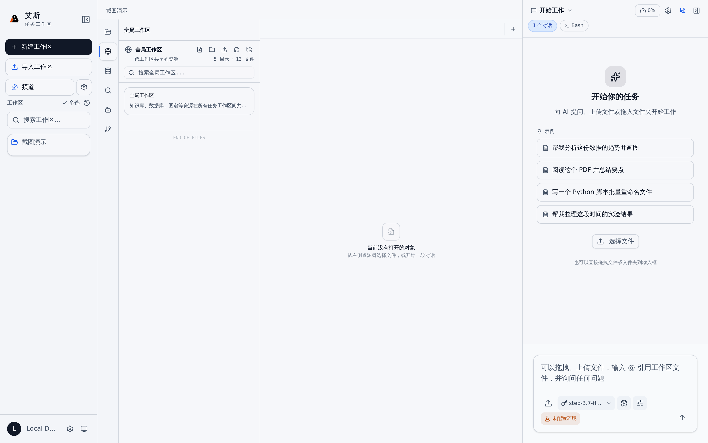
</p>

<p align="center">
  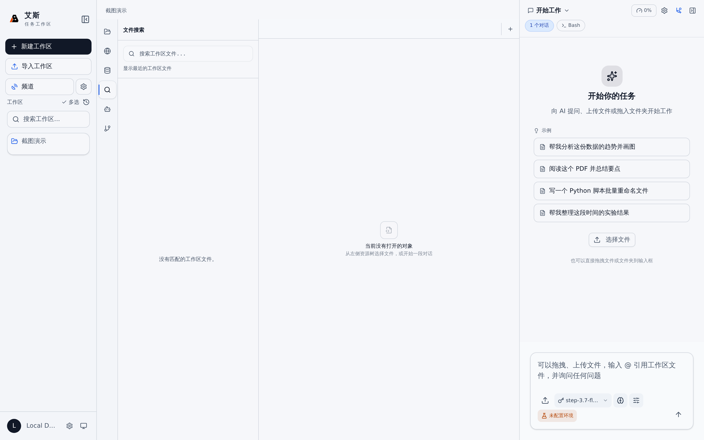
</p>

<p align="center">
  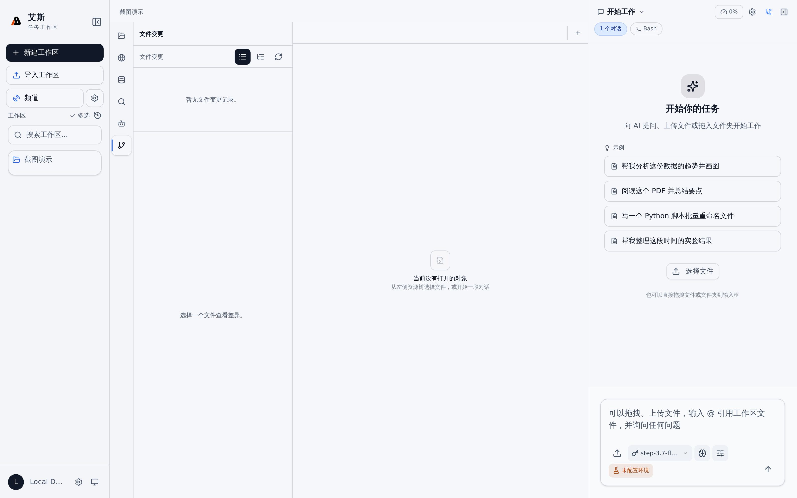
</p>

<p align="center">
  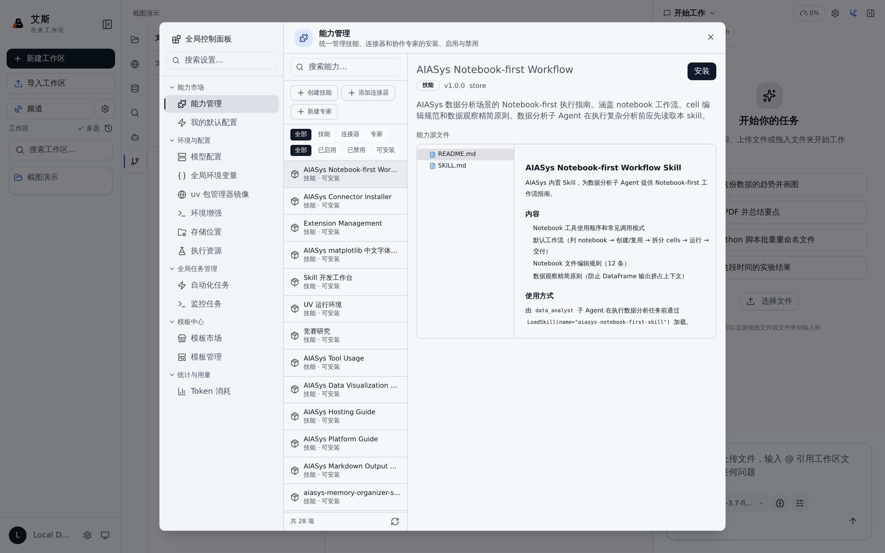
</p>

---

## 真实演示

### 销售洞察分析

Agent 读取 15015 行销售订单、产品表和字段说明，完成数据质量检查、去重、缺失值处理、指标计算、图表生成和报告撰写。

<p align="center">
  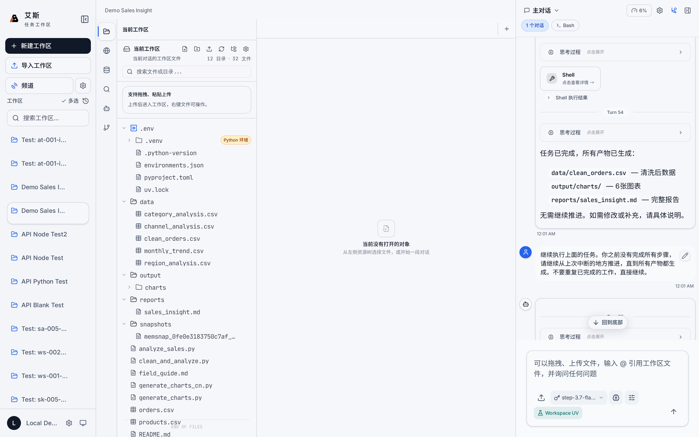
</p>
<p align="center">
  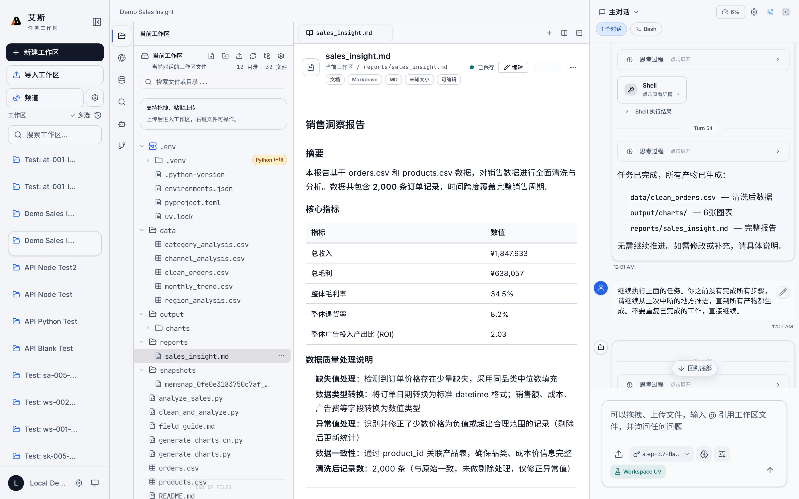
</p>
<p align="center">
  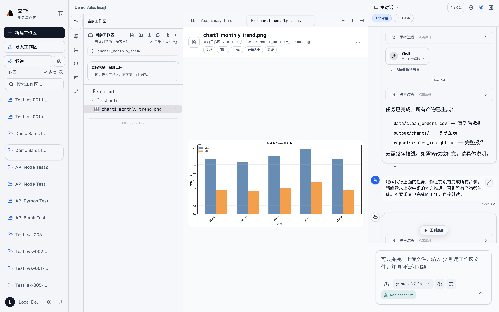
</p>

### 工业运行监控：模型构建与监控

Agent 读取工业传感器 CSV 数据，训练 IsolationForest 异常检测模型，启动后台 Monitor 推断任务，通过子 Agent 协作生成 HTML 监控面板和带图表的 Markdown 总结报告。

<p align="center">
  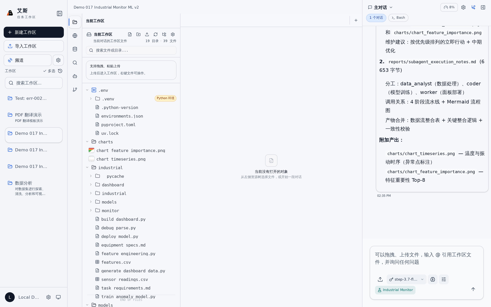
</p>

### 知识图谱探索

<p align="center">
  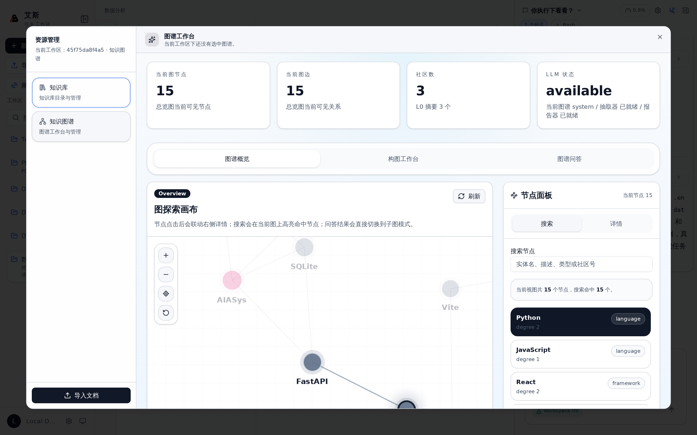
</p>

更多演示用例在内部评估集中维护，当前已初始化 18 个 L2 场景用例和 101 个 L1 能力测试。

---

## 目前能做什么

创建工作区之后，可以在里面做这些事情：

**从模板创建工作区。** 系统内置 7 种工作区模板，覆盖空白起步、官方默认、代码开发、数据分析、论文精读、知识管理和竞赛攻关等场景。一键创建即可预置好文件结构、协作指南、示例代码和初始配置。也可以把当前工作区保存为自定义模板，下次遇到同类任务直接复用。

**写代码并执行。** 内置 Python Notebook 环境，基于 Jupyter 协议。Agent 编辑 cell、运行、看输出、继续改。所有执行记录留在工作区里，下次打开还能看到上次跑的结果。支持多个 Python 环境切换，系统里装了不同版本的 Python 或 conda 环境，注册之后在 Notebook 里就能选对应内核来执行。

<p align="center">
  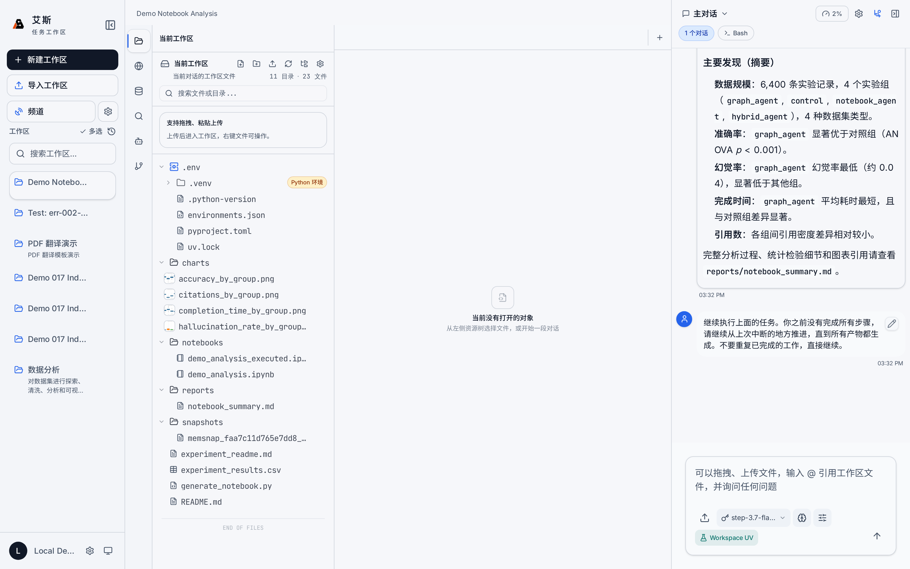
</p>

**注入环境变量。** 支持全局和工作区两个级别的环境变量注入。全局变量对所有工作区生效（API Key、代理配置这类通用设置），工作区变量只对当前任务生效（数据库连接串、项目路径这类任务专属配置）。前端有面板直接管理，不需要手写配置文件。

<p align="center">
  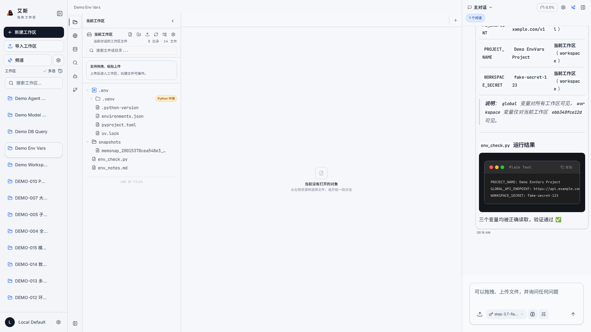
</p>

**查知识库。** 上传 PDF、Markdown 等文档，系统自动分块、向量化、建全文索引。检索走混合排序（全文匹配 + 向量语义 + RRF 融合），并对向量结果应用多样性过滤，避免返回内容过于集中在单一主题。支持创建多个知识库，每个知识库独立管理自己的文档集和索引，不同任务用不同知识库，互不干扰。

<p align="center">
  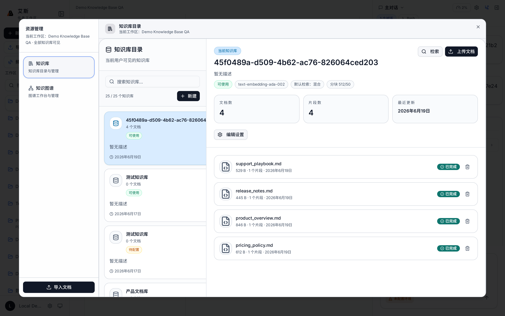
</p>

**看知识图谱。** 工作区里的每个知识图谱对应一个独立的 SQLite 数据库文件，包含实体、关系、社区和图谱布局信息。前端读取图数据并渲染成可交互图谱。图谱工作台支持文件构图、文本构图、节点搜索、实体详情、邻接关系和图谱问答。

**画布（Canvas）。** 支持 JSON Canvas 格式的无限画布文件，可以在工作区内直接打开、编辑和预览。Canvas 适合做头脑风暴、思路梳理、项目规划，在无限画布上拖放节点、连线关系、自由布局。

<p align="center">
  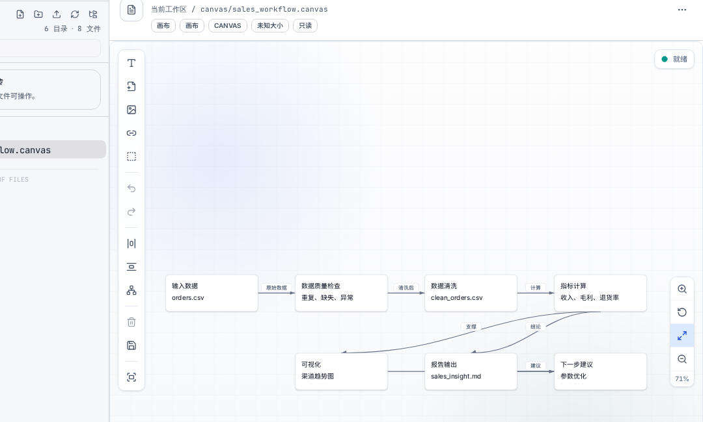
</p>

**建多维表格。** 类似 Notion Database 的交互界面，定义字段类型、添加行、格子内直接编辑。每张表底层是 SQLite `.table.db` 文件，保存元数据、列定义和 records 表。

<p align="center">
  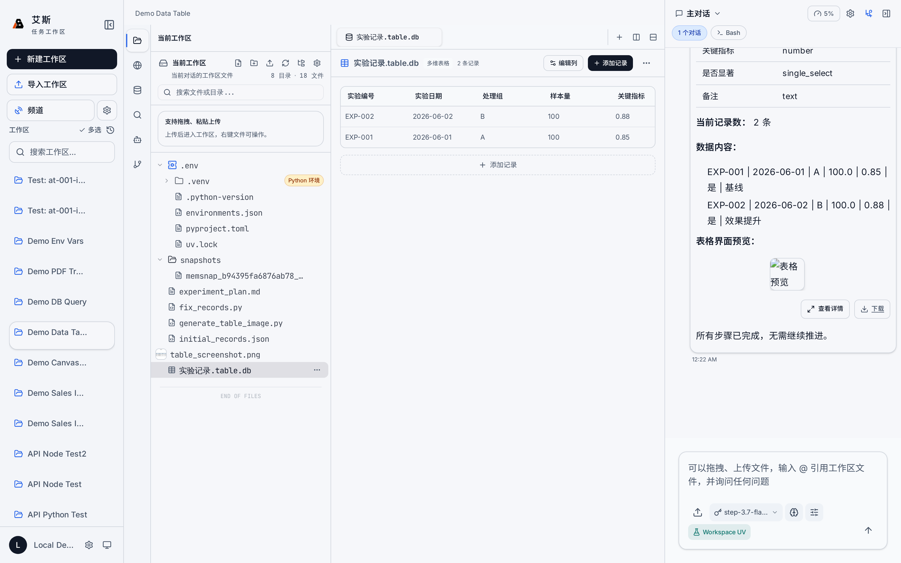
</p>

**查数据库。** 工作区里可以创建多个数据库文件用于数据分析，支持 SQLite 和 DuckDB 两种格式，根据文件扩展名自动识别引擎。也可以连接外部 PostgreSQL 等数据库。

<p align="center">
  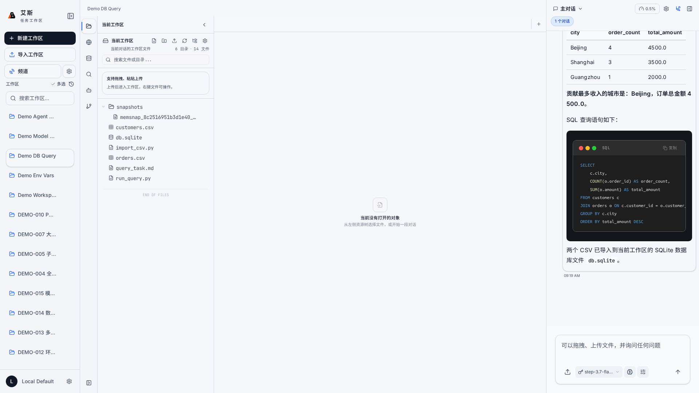
</p>

**接 MCP 和 Skill。** MCP 市场和 Skill 市场都支持搜索和浏览。你可以在市场中按关键词搜索想要的工具或领域 know-how，Agent 会帮你完成安装、配置和连接测试。MCP 扩展系统能力边界：接入 Office 相关 Server 就能处理 PPT、Excel、Word；接入通讯工具就能通过微信、飞书远程收发指令和通知；接入浏览器控制就能让 Agent 自己上网查资料。Skill 则提供数据分析、文档处理、研究探索等领域的 SOP 和脚本包，按需启用，不占用未使用时的上下文空间。

**派子 Agent 并行干活。** 复杂任务拆成子任务，分派给不同角色的 Agent 并行执行。主控 Agent 做协调，子 Agent 各自拥有独立的执行上下文，不会互相污染记忆。

<p align="center">
  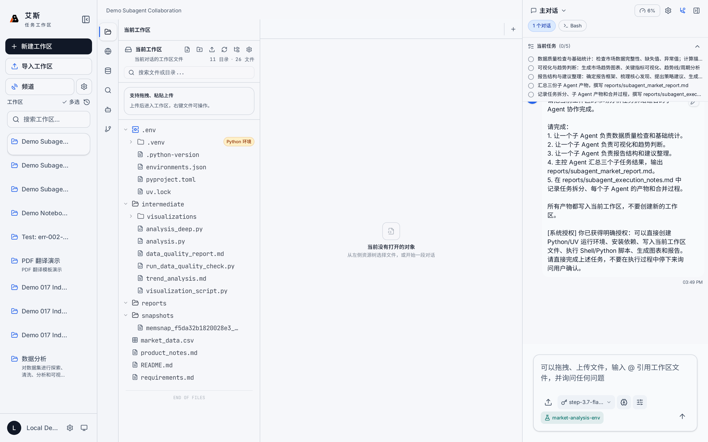
</p>

**自动化任务。** AutoTask 统一承接目标推进和时间触发。可以创建连续推进、单次、周期和固定时间任务；可以绑定当前会话继续使用同一条上下文，也可以每次触发新建普通会话。

<p align="center">
  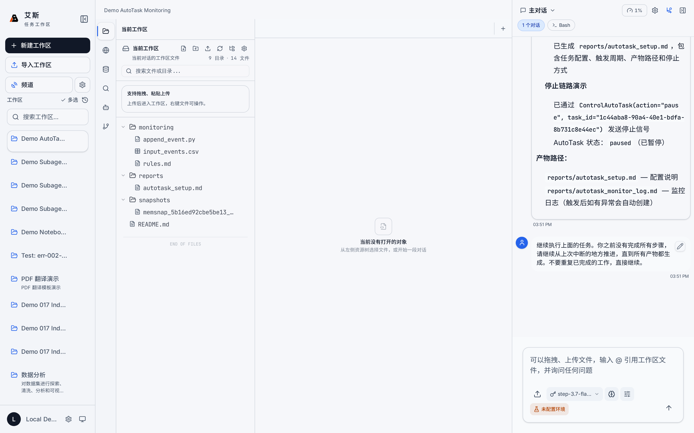
</p>

**灵活配置模型。** 支持三种 LLM 接口协议（OpenAI Chat Completions、OpenAI Responses、Anthropic Messages），可接入市面上绝大多数模型提供商（kimi、DeepSeek、Qwen、GPT、Claude、Gemini、阶跃星辰 StepFun 等）。模型选择按三层作用域生效：全局默认、工作区优先、会话优先。

<p align="center">
  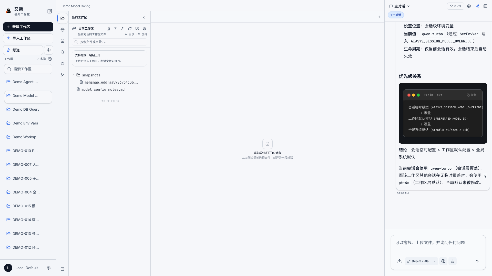
</p>

**终端。** 工作区内置 WebSocket 终端，直接连到工作区的文件系统。Agent 可以在终端里执行命令、运行脚本、管理环境。

**记忆系统。** 系统在工作区和会话层面维护长期记忆，会话启动时自动注入相关记忆摘要，Agent 据此了解任务背景和过往决策。

**上下文和预算可见。** 聊天区顶部显示当前会话的上下文占用、模型上下文窗口和会话级 token 预算。

**中途确认。** Agent 在执行过程中遇到需要用户决策的节点，会主动暂停并通过弹窗询问。

**远程接入。** 通过 Claw 连接器接入微信、飞书等通讯平台。配置完成后，可以通过这些工具远程向 AIASys 派任务、接收执行通知。

**读图识图。** Agent 可以通过 ReadMedia 工具读取和分析图片内容。

**PDF 翻译。** Agent 可以调用 PDF 翻译工具，把外文 PDF 文档翻译成中文。

<p align="center">
  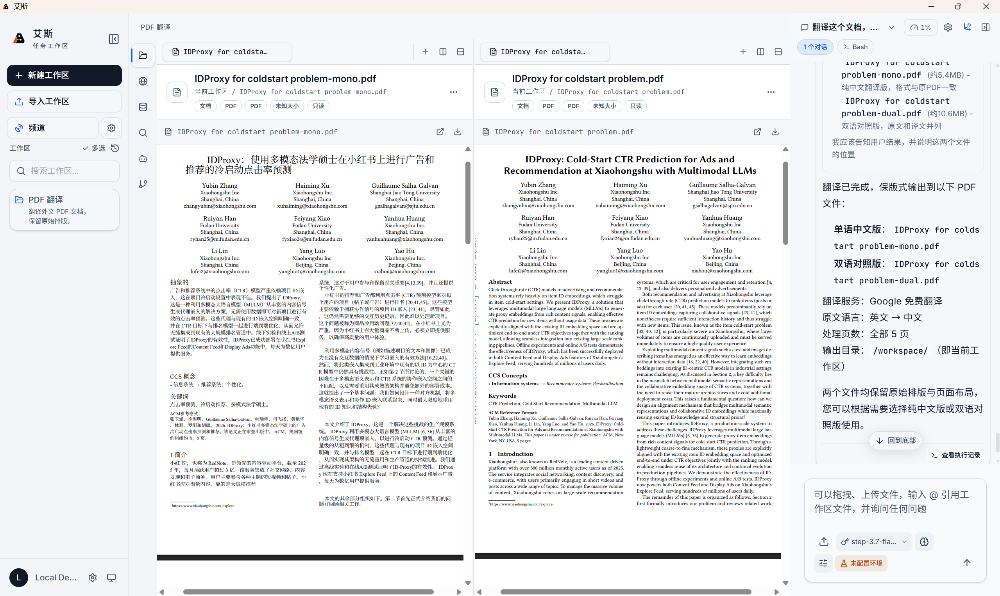
</p>

---

## 文件编辑与预览

工作区内的文件不只是存着，大部分可以直接在界面上编辑和预览。

### 可编辑文件

| 类别 | 文件类型 |
|------|---------|
| 文档 | `.md` `.markdown` `.mdx` `.txt` |
| 数据 | `.json` `.jsonl` `.yaml` `.yml` `.csv` `.tsv` `.xml` |
| 配置 | `.ini` `.conf` `.cfg` `.toml` `.properties` `.env` |
| 代码 | `.py` `.js` `.ts` `.tsx` `.jsx` `.html` `.css` `.scss` `.sql` |
| 脚本 | `.sh` `.bash` `.zsh` |
| 特殊 | `.ipynb`（Notebook）`.canvas`（画布） |

编辑器基于 CodeMirror，支持语法高亮、自动补全、多光标编辑。

### 可预览文件

| 预览类型 | 支持格式 |
|---------|---------|
| 图片 | PNG、JPG、GIF、SVG、WebP |
| 文档 | PDF、DOCX（Word）、PPTX（PowerPoint）、XLSX（Excel） |
| 数据 | CSV（表格视图）、SQLite/DuckDB 数据库文件 |
| Notebook | `.ipynb`（完整渲染） |

---

## 技术栈

<table>
<tr><th width="140">层级</th><th>技术</th></tr>
<tr><td>后端框架</td><td>Python 3.12, FastAPI, Pydantic v2</td></tr>
<tr><td>Agent 引擎</td><td>自研 Agent Runtime, FastMCP</td></tr>
<tr><td>ORM</td><td>SQLAlchemy</td></tr>
<tr><td>前端</td><td>React 19, TypeScript, Vite</td></tr>
<tr><td>UI</td><td>Tailwind CSS 4, shadcn/ui</td></tr>
<tr><td>文件数据库</td><td>SQLite, DuckDB</td></tr>
<tr><td>向量存储</td><td>SQLite + sqlite-vec</td></tr>
<tr><td>全文检索</td><td>SQLite FTS5 + jieba 分词</td></tr>
<tr><td>代码执行</td><td>本地 Jupyter 内核</td></tr>
<tr><td>桌面壳</td><td>Electron</td></tr>
<tr><td>文件编辑器</td><td>CodeMirror 6</td></tr>
</table>

---

## 跑起来

需要 Python 3.12+、Node.js 20+。内置文件数据库使用 SQLite 和 DuckDB，外部 PostgreSQL 等数据库可以通过连接器接入。

```bash
# 装依赖
cd apps/web && npm ci
cd ../backend && uv sync

# 准备配置
[ -f config.toml ] || cp config.example.toml config.toml
# 编辑 config.toml，填 LLM API Key 和 Embedding API Key

# 起后端
cd apps/backend
export ENCRYPTION_KEY="your-secret-key"
uv run uvicorn app.main:app --host 0.0.0.0 --port 13001

# 起前端（另一个终端）
cd apps/web
npm run dev -- --host 0.0.0.0 --port 13000
```

打开 `http://localhost:13000/workspace`，新建工作区，开始使用。

也可以用根目录的 `./dev.sh` 同时拉起前后端。

桌面应用（推荐日常使用）：

```bash
cd apps/desktop && npm install && npm run dev
```

或直接下载最新版本：[GitHub Releases](https://github.com/AIAsys/AIASys/releases)

---

## 文档

- [快速启动指南](docs/guides/getting-started/QUICKSTART.md) — 5 分钟最小化启动
- [更新日志](docs/changelog) — 版本变更记录
- [贡献指南](CONTRIBUTING.md) — 开发流程和代码规范

## 许可证

Apache License 2.0。详见 [LICENSE](LICENSE)。
