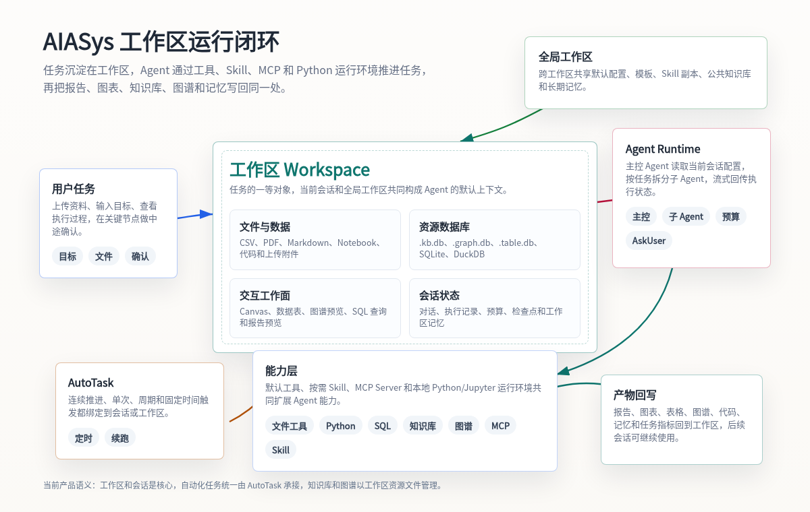

<p align="center">
  
</p>

<h1 align="center">AIASys</h1>

<h3 align="center">以持久化任务工作区为核心的本地优先 AI 工作台</h3>

<p align="center">
  面向科研、数据分析、知识生产和长期项目推进，把对话、文件、代码执行、知识库、图谱、画布、记忆和自动化任务沉淀在同一个可持续演进的工作区里。
</p>

<p align="center">
  
  
  
  
  
  
</p>

<p align="center">
  
  
  
</p>

<p align="center">
  <a href="https://github.com/AIAsys/AIASys/releases">下载安装</a> ·
  <a href="docs/guides/getting-started/QUICKSTART.md">快速开始</a> ·
  <a href="docs/guides/getting-started/SYSTEM_USAGE.md">使用指南</a> ·
  <a href="docs/README.md">文档中心</a> ·
  <a href="docs/changelog">更新日志</a>
</p>

---

AIASys（艾斯）是一款本地部署的 AI Agent 工作平台。它不把任务压进一次性聊天窗口，而是围绕“任务工作区”组织资料、上下文、执行过程和最终产物，让复杂任务可以被回看、继续、复用和扩展。

<p align="center">
  
</p>

桌面版是推荐日常使用形态，Web 版适合开发调试、临时访问和私有部署。当前重点场景包括论文精读、数据分析、代码实验、知识管理、自动化任务和多 Agent 协作。

<p align="center">
  
</p>

## 为什么用 AIASys

- **工作区先于会话**：文件、会话、Notebook 执行记录、知识库、图谱、画布、记忆和产物都沉淀在工作区内。
- **本地优先**：单机单用户、本地数据存储、本地代码执行，适合个人电脑、实验环境和私有部署。
- **面向研究与分析**：内置文档检索、知识图谱、SQLite/DuckDB 查询、多维表格、Canvas 与 Python Notebook。
- **可扩展的 Agent 能力**：通过 MCP 与 Skill 市场接入外部工具、领域流程、办公能力和协作专家。
- **长期任务自动推进**：AutoTask 可承接连续推进、单次触发、周期触发和固定时间触发。

## 快速开始

### 下载桌面版

日常使用优先选择桌面版，它会自动管理前后端服务：

- [GitHub Releases](https://github.com/AIAsys/AIASys/releases)
- 桌面版说明：[docs/guides/getting-started/desktop-app.md](docs/guides/getting-started/desktop-app.md)

### 从源码运行

前置要求：

- Python 3.12+
- Node.js 22+
- npm
- uv

安装依赖：

```bash
git clone https://github.com/AIAsys/AIASys.git
cd AIASys

cd apps/backend
[ -f config.toml ] || cp config.example.toml config.toml
uv sync
cd ../..

cd apps/web
npm ci
cd ../..
```

启动开发环境：

```bash
./dev.sh
```

默认地址：

- Web 界面：`http://127.0.0.1:13000`
- 工作区：`http://127.0.0.1:13000/workspace`
- 后端服务：`http://127.0.0.1:13001`

首次启动后，请在界面的模型配置中添加至少一个 Chat 模型和一个 Embedding 模型。完整步骤见 [快速启动指南](docs/guides/getting-started/QUICKSTART.md)。

## 核心能力

| 能力 | 简介 | 文档 |
|---|---|---|
| 工作区与模板 | 创建长期任务工作区，复用内置或自定义模板 | [workspace-creation](docs/guides/workspace/workspace-creation.md) · [workspace-templates](docs/guides/workspace/workspace-templates.md) |
| 会话与 Agent | 在工作区内推进任务、管理上下文、配置专家角色 | [agent-chat](docs/guides/agent/agent-chat.md) · [expert-roles](docs/guides/agent/expert-roles.md) |
| Notebook 与代码执行 | 在工作区内运行 Python/Jupyter 代码并保留过程 | [notebook-usage](docs/guides/development/notebook-usage.md) |
| 知识库检索 | 上传文档，构建全文检索与向量检索 | [knowledge-base](docs/guides/capabilities/knowledge-base.md) |
| 知识图谱 | 从文件或文本构建实体关系图谱并问答 | [knowledge-graph](docs/guides/capabilities/knowledge-graph.md) |
| 数据库与多维表格 | 查询 SQLite/DuckDB/PostgreSQL，维护结构化实验记录 | [database-query](docs/guides/development/database-query.md) · [data-table-usage](docs/guides/development/data-table-usage.md) |
| Canvas 画布 | 打开、编辑和预览 JSON Canvas 工作流 | [canvas-usage](docs/guides/development/canvas-usage.md) |
| MCP 与 Skill | 安装、配置和测试外部工具能力与领域技能 | [mcp-skill-market](docs/guides/capabilities/mcp-skill-market.md) |
| AutoTask | 将任务设置为连续推进或定时触发 | [autotask](docs/guides/agent/autotask.md) |

## 技术栈

- 后端：Python 3.12, FastAPI, Pydantic v2, SQLAlchemy
- 前端：React 19, TypeScript, Vite, Tailwind CSS 4, shadcn/ui
- 桌面端：Electron
- 数据与检索：SQLite, DuckDB, sqlite-vec, SQLite FTS5
- 代码执行：本地 Jupyter 内核
- 编辑器：CodeMirror 6

## 文档入口

- 新协作者启动：[docs/guides/getting-started/QUICKSTART.md](docs/guides/getting-started/QUICKSTART.md)
- 完整使用指南：[docs/guides/getting-started/SYSTEM_USAGE.md](docs/guides/getting-started/SYSTEM_USAGE.md)
- 桌面应用：[docs/guides/getting-started/desktop-app.md](docs/guides/getting-started/desktop-app.md)
- 部署说明：[docs/deployment.md](docs/deployment.md)
- 文档中心：[docs/README.md](docs/README.md)
- 贡献指南：[CONTRIBUTING.md](CONTRIBUTING.md)

## 许可证

AIASys 基于 Apache License 2.0 开源。详见 [LICENSE](LICENSE)。
