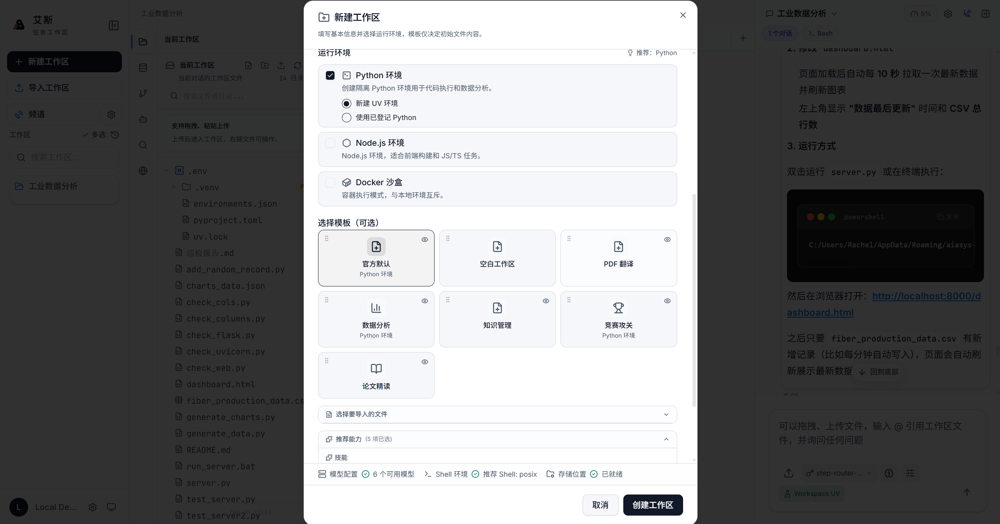
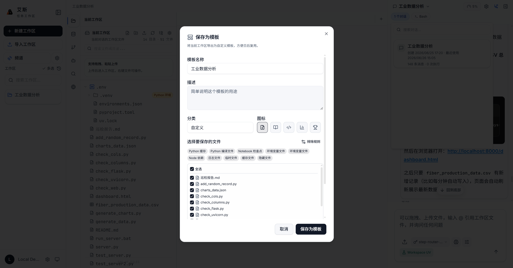
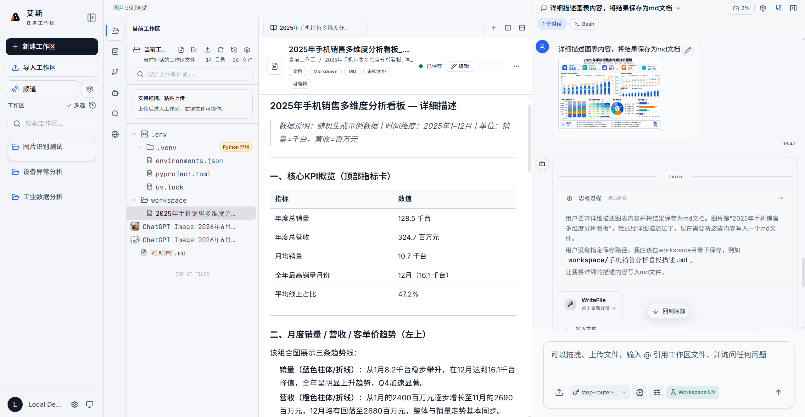

<p align="center">
  
</p>

<h1 align="center">AIASys</h1>

<h3 align="center">以持久化任务工作区为核心的 AI 工作台</h3>

<p align="center">
  面向科研、数据分析、知识管理与复杂项目推进，将对话、文件、代码、数据、知识库、图谱、画布、记忆和自动化任务统一组织在可持续演进的工作区中。
</p>

<p align="center">
  
  
  
  
  
  
</p>

<p align="center">
  
  
  
</p>

<p align="center">
  <a href="https://github.com/AIAsys/AIASys/releases">下载安装</a> ·
  <a href="docs/guides/getting-started/QUICKSTART.md">快速开始</a> ·
  <a href="docs/changelog">更新日志</a> ·
  <a href="CONTRIBUTING.md">参与贡献</a>
</p>

---

## 项目简介

AIASys（艾斯）是一款本地优先的 AI 工作台，围绕“任务工作区”组织复杂任务的完整生命周期。与传统以单次会话为中心的 AI 工具不同，AIASys 将任务相关的上下文、文件、执行记录、知识检索、数据分析、可视化产物和长期记忆沉淀在同一个工作区中，使任务能够被回看、继续、复用和扩展。

在 AIASys 中，对话不再是唯一的工作载体，而是推动工作区持续演进的入口。用户可以在一个工作区中管理资料、编写并运行代码、构建知识库与知识图谱、查询数据库、维护多维表格、组织画布思路、派发子 Agent、创建自动化任务，并通过 MCP 与 Skill 生态接入更多外部能力。

AIASys 当前重点服务科研、数据分析、知识生产、代码实验和长期项目推进场景。系统优先支持单机单用户、本地数据存储和本地代码执行，同时提供桌面端与 Web 端两种使用形态，便于在个人电脑、实验环境或私有部署环境中使用。

<p align="center">
  
</p>

## 核心价值

### 持久化任务工作区

每个复杂任务都可以被组织为一个独立工作区。工作区保存文件、会话、代码执行记录、数据资源、知识库、知识图谱、画布、记忆和产物，让任务上下文不再依赖单次聊天窗口。关闭应用或切换会话后，任务仍可以从原状态继续推进。

### 从内容生成走向知识生产

AIASys 不只帮助生成文本、图表或文档，更强调把中间过程沉淀为可复用的知识资产。系统内置文档检索、知识图谱、多维表格、数据库查询、Canvas 画布和长期记忆能力，支持从资料整理、证据分析到结构化研究产出的完整链路。

### 多会话与多 Agent 协同

同一工作区可以开启多条会话分支，用于主线方案推进、实验验证、资料补充或并行探索。复杂任务可以进一步拆分给不同角色的子 Agent 执行，由主控 Agent 协调结果，减少长任务中的上下文干扰。

### 本地优先与生态扩展

AIASys 支持本地单机使用、数据本地存储、代码本地执行和桌面端运行。通过 MCP 市场与 Skill 市场，系统可以扩展 Office 文档处理、浏览器控制、远程通讯、数据分析、研究流程等外部能力，兼顾可控性与扩展性。

## 产品架构

AIASys 的核心链路围绕工作区展开：用户将目标、资料和上下文放入工作区；Agent 读取当前会话、工作区和全局工作区资源，通过内置工具、Python/Jupyter 运行环境、Skill 与 MCP 推进任务；报告、图表、数据表、知识库、图谱和记忆再写回同一个工作区，供后续会话继续使用。

<p align="center">
  
</p>

主界面采用三栏结构：左侧 Activity Bar 提供当前工作区、全局工作区、数据查询、文件搜索、专家协作节点和文件变更等入口；中间主画布承载文件树、资源、能力、数据和各种预览对象；右侧会话栏负责 Agent 对话、执行状态、上下文与输入。

<p align="center">
  
</p>

## 关键能力

### 工作区与模板

AIASys 内置多种工作区模板，覆盖空白起步、官方默认、代码开发、数据分析、论文精读、知识管理和竞赛攻关等场景。用户可以一键创建预置文件结构、协作指南、示例代码和初始配置，也可以将当前工作区保存为自定义模板，在同类任务中持续复用。

<p align="center">
  
</p>

<p align="center">
  
</p>

### 代码执行与 Notebook

系统内置 Python Notebook 环境，基于 Jupyter 协议支持 Agent 编辑、运行和迭代代码单元。所有执行记录保存在工作区中，便于复现实验过程、追踪中间结果和继续分析。系统也支持多个 Python 环境切换，适配不同项目依赖。

<p align="center">
  
</p>

### 知识库检索

AIASys 支持上传 PDF、Markdown 等文档并自动完成分块、向量化和全文索引。检索过程结合全文匹配、向量语义和 RRF 融合排序，并对结果进行多样性过滤，适用于论文精读、资料检索、知识问答和长期资料库建设。

<p align="center">
  
</p>

### 知识图谱

工作区中的知识图谱以独立 SQLite 数据库文件保存实体、关系、社区和图谱布局信息。前端可将图数据渲染为交互式图谱，并支持文件构图、文本构图、节点搜索、实体详情、邻接关系和图谱问答。

<p align="center">
  
</p>

### 数据库与多维表格

工作区可以创建 SQLite、DuckDB 等数据库文件，也可以连接外部 PostgreSQL 等数据库，用于数据分析与查询。多维表格提供类似 Notion Database 的交互界面，支持字段定义、行记录维护和结构化实验记录。

<p align="center">
  
</p>

<p align="center">
  
</p>

### Canvas 画布

AIASys 支持 JSON Canvas 格式的无限画布文件，可在工作区内直接打开、编辑和预览。画布适合用于头脑风暴、研究路线梳理、项目规划和多节点关系表达。

<p align="center">
  
</p>

### 文件编辑与预览

工作区内的大部分文件可以直接在界面上编辑或预览。编辑器基于 CodeMirror，支持语法高亮、自动补全和多光标编辑；预览能力覆盖图片、PDF、Office 文档、CSV、数据库文件与 Notebook。

| 类型 | 支持范围 |
|------|---------|
| 可编辑文档 | `.md` `.markdown` `.mdx` `.txt` |
| 可编辑数据 | `.json` `.jsonl` `.yaml` `.yml` `.csv` `.tsv` `.xml` |
| 可编辑配置 | `.ini` `.conf` `.cfg` `.toml` `.properties` `.env` |
| 可编辑代码 | `.py` `.js` `.ts` `.tsx` `.jsx` `.html` `.css` `.scss` `.sql` |
| 可编辑脚本 | `.sh` `.bash` `.zsh` |
| 特殊文件 | `.ipynb` `.canvas` |
| 可预览文档 | PDF、DOCX、PPTX、XLSX |
| 可预览数据 | CSV、SQLite、DuckDB |
| 可预览图片 | PNG、JPG、GIF、SVG、WebP |

### 能力市场与模型配置

MCP 市场与 Skill 市场支持搜索、浏览、安装、配置和连接测试。MCP 用于扩展外部系统能力，Skill 用于沉淀领域流程、工具脚本和专业 know-how。模型配置支持 OpenAI Chat Completions、OpenAI Responses、Anthropic Messages 三类接口协议，可接入 Kimi、DeepSeek、Qwen、GPT、Claude、Gemini、StepFun 等主流模型服务商。

<p align="center">
  
</p>

<p align="center">
  
</p>

### 子 Agent、自动化与远程接入

复杂任务可以拆分为多个子任务，由不同角色的子 Agent 并行执行。AutoTask 支持连续推进、单次触发、周期触发和固定时间触发，可绑定当前会话继续推进，也可按任务新建会话。通过 Claw 连接器，系统还可以接入微信、飞书等通讯平台，用于远程派发任务和接收执行通知。

<p align="center">
  
</p>

<p align="center">
  
</p>

<p align="center">
  
</p>

### 工作区面板与全局资源

左侧 Activity Bar 提供当前工作区文件树、跨工作区共享的全局工作区资源、数据查询、文件搜索、专家协作节点和文件变更历史。全局工作区可用于统一管理跨任务复用的知识库、数据库、图谱等资源。

<p align="center">
  
</p>

<p align="center">
  
</p>

<p align="center">
  
</p>

## 场景展示

### 销售洞察分析

Agent 读取 15015 行销售订单、产品表和字段说明，完成数据质量检查、去重、缺失值处理、指标计算、图表生成和报告撰写，形成可回看、可继续修改的数据分析工作区。

<p align="center">
  
</p>

<p align="center">
  
</p>

<p align="center">
  
</p>

### 工业运行监控

Agent 读取工业传感器 CSV 数据，训练 IsolationForest 异常检测模型，启动后台 Monitor 推断任务，并通过子 Agent 协作生成 HTML 监控面板和 Markdown 总结报告。

<p align="center">
  
</p>

### 文档翻译与图像理解

AIASys 支持调用 PDF 翻译工具处理外文 PDF，也支持通过 ReadMedia 工具读取和分析图片、图表等视觉内容，便于在研究和分析任务中统一管理多模态资料。

<p align="center">
  
</p>

<p align="center">
  
</p>

## 技术栈

<table>
<tr><th width="150">层级</th><th>技术</th></tr>
<tr><td>后端框架</td><td>Python 3.12, FastAPI, Pydantic v2</td></tr>
<tr><td>Agent 引擎</td><td>自研 Agent Runtime, FastMCP</td></tr>
<tr><td>ORM</td><td>SQLAlchemy</td></tr>
<tr><td>前端</td><td>React 19, TypeScript, Vite</td></tr>
<tr><td>UI</td><td>Tailwind CSS 4, shadcn/ui</td></tr>
<tr><td>文件数据库</td><td>SQLite, DuckDB</td></tr>
<tr><td>向量存储</td><td>SQLite, sqlite-vec</td></tr>
<tr><td>全文检索</td><td>SQLite FTS5, jieba 分词</td></tr>
<tr><td>代码执行</td><td>本地 Jupyter 内核</td></tr>
<tr><td>桌面应用</td><td>Electron</td></tr>
<tr><td>文件编辑器</td><td>CodeMirror 6</td></tr>
</table>

## 快速开始

### 前置要求

- Python 3.12+
- Node.js 22+
- npm
- uv
- Docker，可选，用于工作区 Docker 沙盒资源
- Redis，可选，未安装时系统会回退到内存模式

### 安装依赖

```bash
git clone https://github.com/AIAsys/AIASys.git
cd AIASys

cd apps/backend
[ -f config.toml ] || cp config.example.toml config.toml
uv sync
cd ../..

cd apps/web
npm ci
cd ../..
```

### 启动开发环境

项目根目录提供统一开发启动入口：

```bash
./dev.sh
```

默认服务地址：

- 前端界面：`http://127.0.0.1:13000`
- 分析工作区：`http://127.0.0.1:13000/workspace`
- 后端服务：`http://127.0.0.1:13001`

查看服务状态：

```bash
./dev.sh status
```

首次启动后，请先在界面的模型配置中添加至少一个 Chat 模型和一个 Embedding 模型，以启用 Agent 对话、知识库向量化、自动任务和上下文压缩等功能。详细步骤见 [快速启动指南](docs/guides/getting-started/QUICKSTART.md)。

### 桌面版

桌面版会自动管理前后端服务，是日常使用推荐形态：

```bash
cd apps/desktop
npm install
npm run dev
```

也可以从 [GitHub Releases](https://github.com/AIAsys/AIASys/releases) 下载预构建版本。

## 文档

- [快速启动指南](docs/guides/getting-started/QUICKSTART.md)
- [系统使用说明](docs/guides/getting-started/SYSTEM_USAGE.md)
- [桌面应用文档](docs/guides/getting-started/desktop-app.md)
- [部署说明](docs/deployment.md)
- [更新日志](docs/changelog)
- [贡献指南](CONTRIBUTING.md)

## 许可证

AIASys 基于 Apache License 2.0 开源。详见 [LICENSE](LICENSE)。
