<p align="center">
  
</p>

<h3 align="center">AIASys — 以任务工作区为中心的 AI 工作台</h3>

<p align="center">v0.4.0</p>

<p align="center">
  <a href="./LICENSE">Apache 2.0</a>
</p>

---

## 这个项目解决什么问题

用 AI 工具推进复杂任务时，有一个问题反复出现：关闭浏览器之后，上一轮的上下文就丢了。文件散落在各个目录，实验结论记在聊天记录里，中间推导过程随着标签页关闭一起消失。下次继续同一个任务，得重新描述背景、重新上传资料、重新让 AI 理解你想干什么。

AIASys 的做法是把"任务"变成一个持久的工作区。文件、代码执行记录、知识库检索结果、对话都留在这个工作区里。关闭浏览器不影响任何东西，下次打开工作区，一切都在原地。

这和一般的 chatbot 式 AI 有本质区别。Chatbot 的交互模型是"一轮一问"，上下文在聊天记录里，关闭就丢，下次得重新描述背景。AIASys 的工作区是任务的持久载体，所有中间产物（文件、代码、数据、图表、知识库、图谱）都沉淀在工作区内，对话只是推进任务的一个入口，不是唯一的记忆载体。结果是可回看、可继续、可复用的，不是聊完就散的纯文本流。

不管你是做数据分析、跑实验、写论文，还是做 PPT、处理 Excel、写周报、整理文档，同一个工作区逻辑都适用。系统的内核是为科研和数据分析场景优化的（本地代码执行、混合检索、知识图谱、多维表格），但通用办公场景通过 MCP 市场和 Skill 市场接入外部能力后同样覆盖得很好。

工作区支持多会话。同一个任务可以同时走几条不同的思路，主线稳定推进，实验会话大胆尝试。会话之间共享文件系统，对话历史和执行状态各自独立。试错了就切回去，不用删东西重来。

默认走本地执行链路。代码在用户机器上跑，数据本地存储，文件系统直接映射。

AIASys 同时支持 Web 界面和桌面应用两种形态。桌面版基于 Electron 薄壳，是优先推荐的日常使用方式，有原生窗口、系统托盘和本地端口自动管理。Web 版适合临时访问和远程使用场景。桌面版目标支持 Windows、macOS、Linux 三端。

<p align="center">
  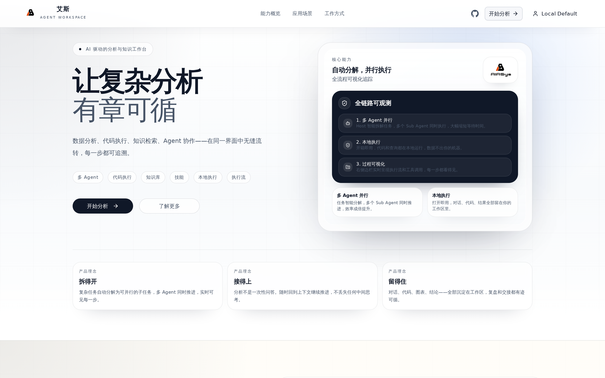
</p>

---

## 目前能做什么

创建工作区之后，可以在里面做这些事情：

📋 **从模板创建工作区。** 系统内置 7 种工作区模板，覆盖空白起步、官方默认、代码开发、数据分析、论文精读、知识管理和竞赛攻关等场景。一键创建即可预置好文件结构、AGENTS.md 协作指南、示例代码和初始配置。也可以把当前工作区保存为自定义模板，下次遇到同类任务直接复用。

<p align="center">
  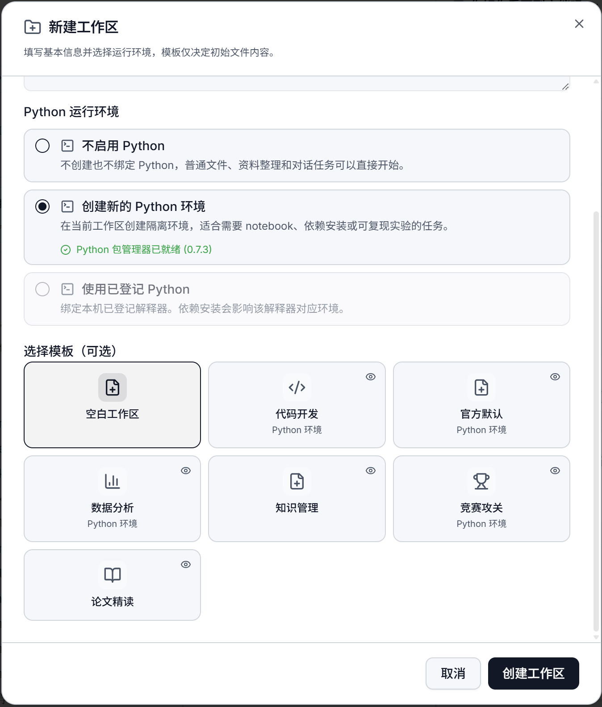
</p>

📝 **写代码并执行。** 内置 Python Notebook 环境，基于 Jupyter 协议。Agent 编辑 cell、运行、看输出、继续改。所有执行记录留在工作区里，下次打开还能看到上次跑的结果。支持多个 Python 环境切换，系统里装了不同版本的 Python 或 conda 环境，注册之后在 Notebook 里就能选对应内核来执行。

<p align="center">
  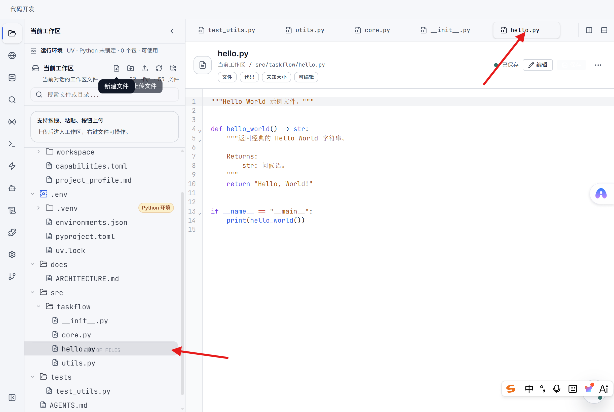
</p>

🔧 **注入环境变量。** 支持全局和工作区两个级别的环境变量注入。全局变量对所有工作区生效（API Key、代理配置这类通用设置），工作区变量只对当前任务生效（数据库连接串、项目路径这类任务专属配置）。前端有面板直接管理，不需要手写配置文件。

<p align="center">
  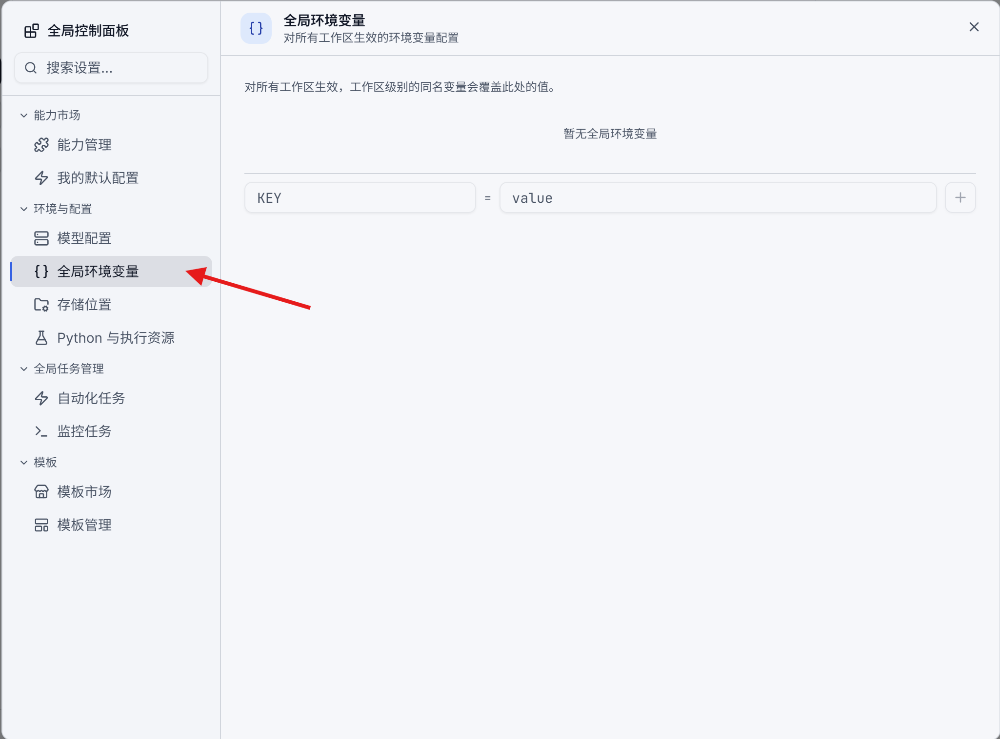
</p>

📚 **查知识库。** 上传 PDF、Markdown 等文档，系统自动分块、向量化、建全文索引。底层用 SQLite + sqlite-vec 做向量存储，检索走混合排序（全文匹配 + 向量语义 + RRF 融合），并对向量结果应用 maxSpread 多样性过滤，避免返回内容过于集中在单一主题。支持创建多个知识库，每个知识库独立管理自己的文档集和索引，不同任务用不同知识库，互不干扰。结构化数据可以先通过数据库工具查询并保存为工作区文件，再导入知识库进入语义检索体系。Agent 可以通过系统内置工具创建和更新知识库、上传文档、列出文档、删除文档、查询内容。知识库本身也是工作区里的一种资源文件，可以在侧栏里像打开文件一样预览和管理。

<p align="center">
  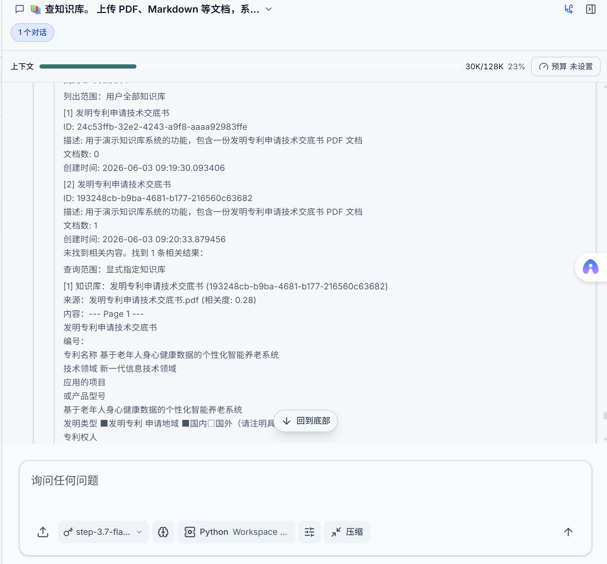
</p>

🕸️ **看知识图谱。** 工作区里的每个知识图谱对应一个独立的 SQLite 数据库文件，包含实体、关系、社区和图谱布局信息。前端用 Pixi.js 读取图数据并渲染成力导向图，d3-force 计算布局。支持多个知识图谱并行管理，每个图谱有独立的实体和关系集，论文引用关系、项目依赖关系、知识分类体系可以分别建图。图谱工作台支持文件构图、文本构图、节点搜索、实体详情、邻接关系和图谱问答。Agent 也可以通过系统内置工具列出、创建、删除图谱，维护实体和关系，读取社区报告，并把工作区文档导入图谱构建实体关系。和知识库一样，图谱也是工作区资源文件，在侧栏里点击即可预览。

<p align="center">
  
</p>

🎨 **画布（Canvas）。** 支持 JSON Canvas 格式的无限画布文件，可以在工作区内直接打开、编辑和预览。Canvas 适合做头脑风暴、思路梳理、项目规划，在无限画布上拖放节点、连线关系、自由布局。Agent 可以通过系统内置工具读取、覆盖写入和批量修改 `.canvas` 文件；内置 Canvas Skill 则提供脚本化编辑和格式校验。

📊 **建多维表格。** 类似 Notion Database 的交互界面，定义字段类型、添加行、格子内直接编辑。每张表底层是 SQLite `.table.db` 文件，保存元数据、列定义和 records 表。Agent 可以通过系统内置工具创建表、读取 schema、读写记录、增删改列，适合做对比矩阵、实验记录、数据整理。

<p align="center">
  
</p>

🗄️ **查数据库。** 工作区里可以创建多个数据库文件用于数据分析，支持 SQLite 和 DuckDB 两种格式，根据文件扩展名自动识别引擎。也可以连接外部 PostgreSQL 等数据库。查询结果纳入当前会话的对话上下文。

<p align="center">
  
</p>

🔌 **接 MCP 和 Skill。** MCP 市场和 Skill 市场都支持搜索和浏览。你可以在市场中按关键词搜索想要的工具或领域 know-how，Agent 会帮你完成安装、配置和连接测试。MCP 扩展系统能力边界：接入 Office 相关 Server 就能处理 PPT、Excel、Word；接入通讯工具就能通过微信、飞书远程收发指令和通知；接入浏览器控制就能让 Agent 自己上网查资料。Skill 则提供数据分析、文档处理、研究探索等领域的 SOP 和脚本包，按需启用，不占用未使用时的上下文空间。系统内置了 AIASys 平台指南、竞赛研究、Skill 开发、arXiv 搜索、PDF 翻译、PDF 转 Markdown、PaddleOCR 文档提取和 Canvas 编辑等 Skill。

<p align="center">
  
</p>

🤖 **派子 Agent 并行干活。** 复杂任务拆成子任务，分派给不同角色的 Agent 并行执行。主控 Agent 做协调，子 Agent 各自拥有独立的执行上下文，不会互相污染记忆。

<p align="center">
  
</p>

🎯 **自动化任务。** AutoTask 统一承接原来的目标推进和定时触发。可以创建连续推进、单次、周期和固定时间任务；可以绑定当前会话继续使用同一条上下文，也可以每次触发新建普通会话。连续推进会要求 Agent 做完成审计，目标达成时通过 `auto_task_signal` 写回完成，达到轮次、连续错误或用户暂停时停止。会话预算仍由右侧预算入口控制，预算耗尽后对应会话会停止执行。

<p align="center">
  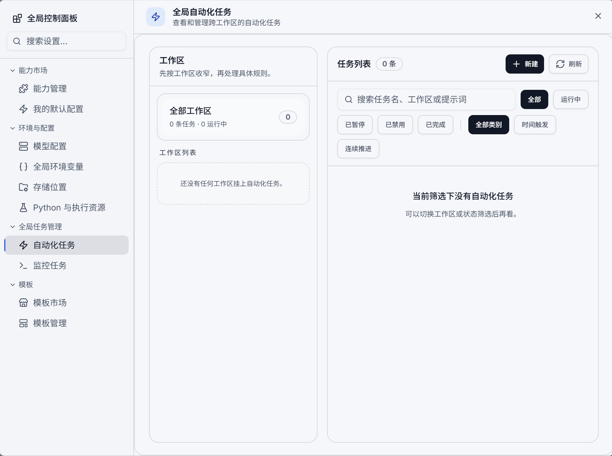
</p>

⚙️ **灵活配置模型。** 支持三种 LLM 接口协议（OpenAI Chat Completions、OpenAI Responses、Anthropic Messages），可接入市面上绝大多数模型提供商（kimi、DeepSeek、Qwen、GPT、Claude、Gemini、阶跃星辰 StepFun 等）。模型选择按三层作用域生效：全局默认、工作区优先、会话优先，粒度由粗到细。更细粒度上，不同任务环节可以指定不同模型：主控对话、上下文压缩、记忆整理、子 Agent 执行各自独立路由。比如主控用 Claude 做深度推理，子 Agent 用 Gemini Flash 做快速代码生成，压缩环节用轻量模型降低成本。前端配置面板统一管理，多提供商同时启用，切换即生效。

<p align="center">
  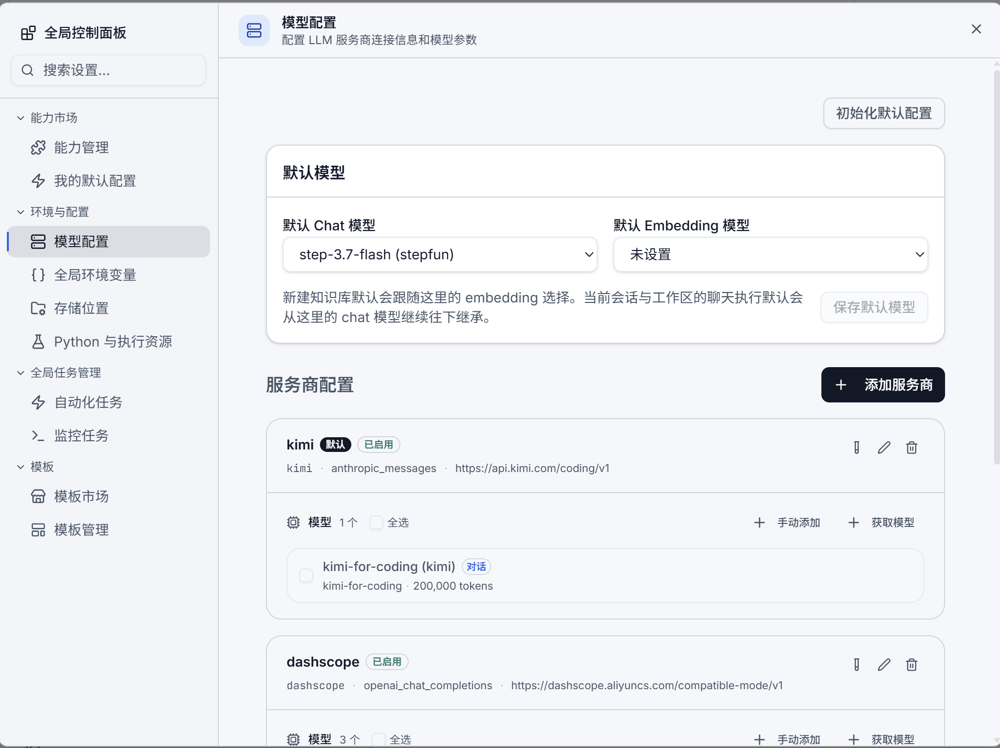
</p>

💻 **终端。** 工作区内置 WebSocket 终端，直接连到工作区的文件系统。Agent 可以在终端里执行命令、运行脚本、管理环境。终端会话附着在当前工作区的工作目录上，和 Notebook 共享同一个文件系统。

<p align="center">
  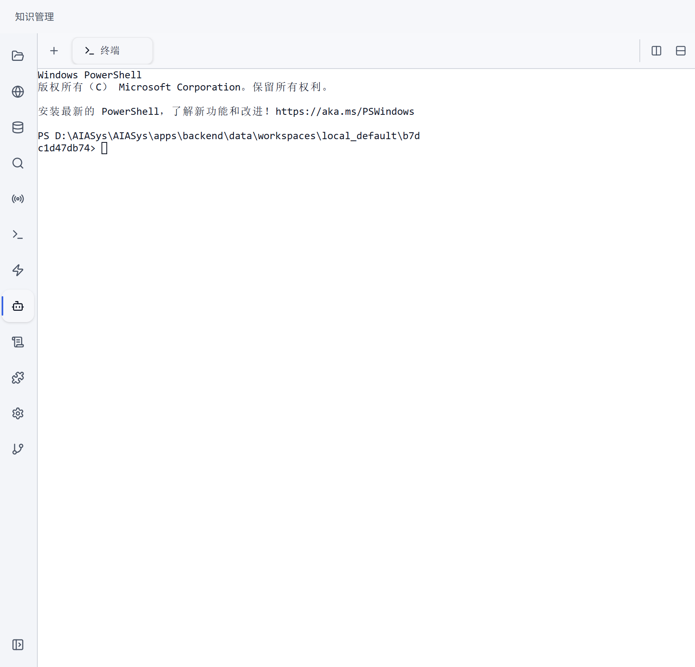
</p>

🧠 **记忆系统。** 系统在工作区和会话层面维护长期记忆，会话启动时自动注入相关记忆摘要，Agent 据此了解任务背景和过往决策。用户也可以在前端面板手动管理记忆条目。

<p align="center">
  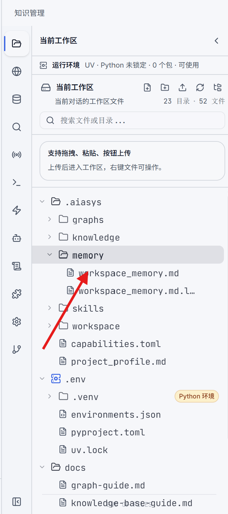
</p>

📏 **上下文和预算可见。** 聊天区顶部显示当前会话的上下文占用、模型上下文窗口和会话级 token 预算。预算限制当前会话的累计消耗，普通对话和自动化任务都受同一上限约束；压缩上下文不会重置已经用掉的预算。

<p align="center">
  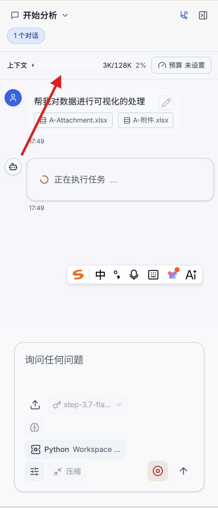
</p>

✋ **中途确认。** Agent 在执行过程中遇到需要用户决策的节点，会主动暂停并通过 AskUser 弹窗询问。用户可以确认、拒绝或输入额外信息，Agent 拿到回复后继续执行。

📡 **远程接入。** 通过 Claw 连接器接入微信、飞书等通讯平台。配置完成后，可以通过这些工具远程向 AIASys 派任务、接收执行通知。也支持扫码登录微信，Agent 可以收发消息。

<p align="center">
  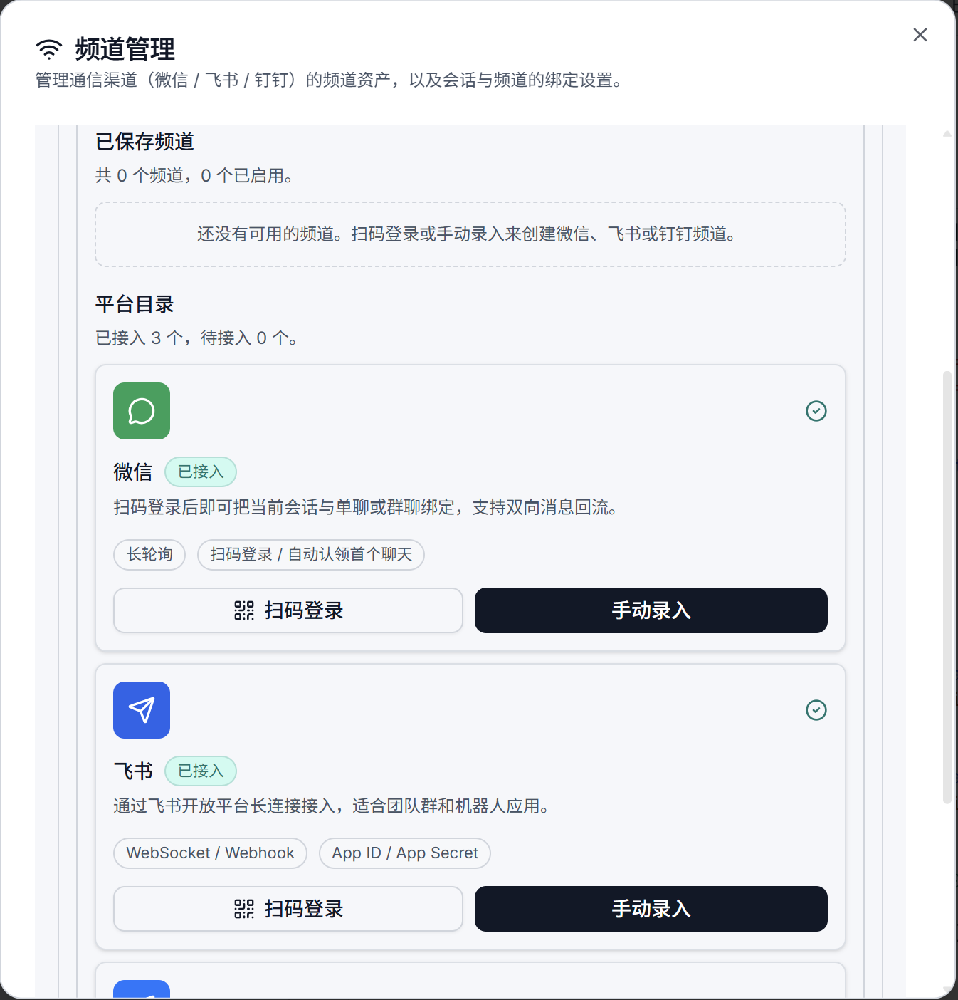
</p>

📦 **会话导出。** 会话的完整历史，包括对话记录、执行日志、生成的文件产物，可以打包导出为 bundle，用于归档、分享或迁移到其他工作区。

⚡ **Agent 配置。** 用户默认的 Agent Soul、工作区项目画像和当前会话覆盖项分层管理。Agent 执行前会读取这些配置，决定协作方式、表达风格、项目边界和本次任务的执行策略。

<p align="center">
  
</p>

🔍 **读图识图。** Agent 可以通过 ReadMedia 工具读取和分析图片内容。扔一张截图给它，它能理解画面里的 UI、图表、文字，然后据此做出响应。适合看图排查问题、根据设计稿写代码、分析图表数据等场景。

🌐 **PDF 翻译。** Agent 可以调用 PDF 翻译工具，把外文 PDF 文档翻译成中文。支持指定源语言和目标语言，翻译结果保留原文结构。

📋 **执行检查点。** 会话执行过程中可以创建检查点，保存当前状态快照。后续可以回看检查点时的文件状态、对话上下文和执行进度。适合在关键决策点留档，出问题时回退对比。

💬 **富文本聊天。** 聊天区支持 Markdown 渲染、ECharts 图表内嵌、数学公式（KaTeX）和代码语法高亮。Agent 的输出不只是纯文本，可以是一张交互式图表、一张对比表格、一段带公式的推导。还有流式思维块展示，Agent 思考过程实时可见。

<p align="center">
  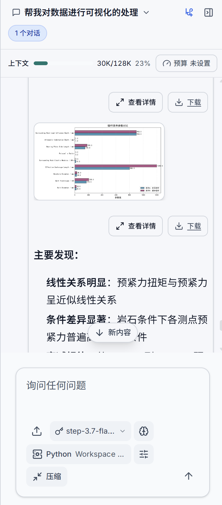
</p>

🖼️ **图片灯箱。** 聊天和文件预览中的图片支持点击放大，进入灯箱模式查看原图。适合查看高清截图、数据图表和大尺寸图片。

<p align="center">
  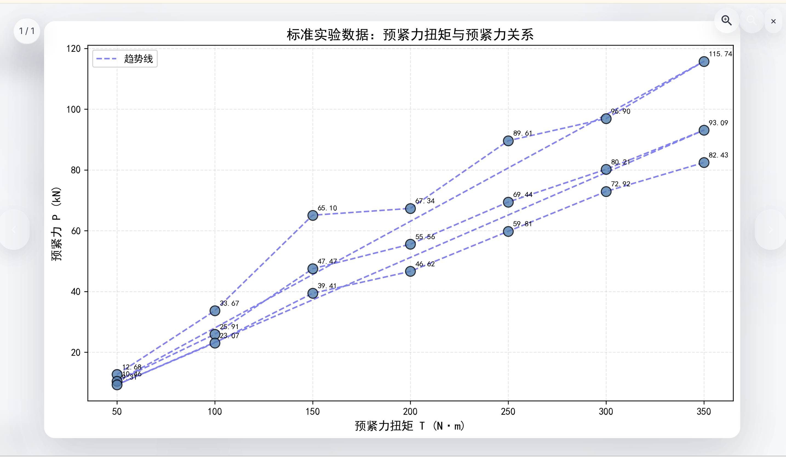
</p>

---

## 文件编辑与预览

工作区内的文件不只是存着，大部分可以直接在界面上编辑和预览。

### 可编辑文件

以下文件类型支持在工作区内直接编辑：

| 类别 | 文件类型 |
|------|---------|
| 文档 | `.md` `.markdown` `.mdx` `.txt` |
| 数据 | `.json` `.jsonl` `.yaml` `.yml` `.csv` `.tsv` `.xml` |
| 配置 | `.ini` `.conf` `.cfg` `.toml` `.properties` `.env` |
| 代码 | `.py` `.js` `.ts` `.tsx` `.jsx` `.html` `.css` `.scss` `.sql` |
| 脚本 | `.sh` `.bash` `.zsh` |
| 特殊 | `.ipynb`（Notebook）`.canvas`（画布） |

编辑器基于 CodeMirror，支持语法高亮、自动补全、多光标编辑。

### 可预览文件

除了编辑，更多文件类型支持在侧栏面板中直接预览：

| 预览类型 | 支持格式 |
|---------|---------|
| 图片 | PNG、JPG、GIF、SVG、WebP |
| 文档 | PDF、DOCX（Word）、PPTX（PowerPoint）、XLSX（Excel） |
| 数据 | CSV（表格视图）、SQLite/DuckDB 数据库文件 |
| Notebook | `.ipynb`（完整渲染） |
| 记忆 | 会话记忆条目预览 |

### 资源即文件

知识库、知识图谱、数据库、记忆、多维表格在 AIASys 里不只是"后台服务"，它们在侧栏里表现为资源节点，点击就能打开预览面板。知识库可以看文档列表和检索，图谱可以看节点关系图，数据库可以看表结构和查询，记忆可以看条目列表。这种设计让所有工作区资产都能在一个地方找到、打开、操作，不需要在不同页面之间来回跳。

---

## 左侧 Activity Bar：工作区导航

左侧图标栏承载了工作区的主要导航和功能入口，按功能拆成多个面板，支持拖拽排序：

| 图标 | 面板 | 功能 |
|------|------|------|
| 📁 | 当前工作区 | 当前工作区的文件浏览，拖拽上传、新建文件/文件夹、搜索和右键操作 |
| 🌐 | 全局工作区 | 跨工作区共享的文件资源，全局知识库、数据库连接等 |
| 🔍 | 文件搜索 | 全文检索工作区文件内容 |
| 🗄️ | 数据查询 | 连接数据库执行 SQL，查看表和字段，结果可作为会话上下文 |
| 🤖 | 专家协作节点 | 查看多 Agent 并行执行流程和可视化执行树 |
| ⚡ | 自动化任务 | 管理连续推进、单次、周期和 Cron 任务 |
| 📝 | 环境变量 | 当前工作区的环境变量可视化编辑 |
| 🧩 | 能力管理 | MCP Server、Skill 和协作专家的管理与配置 |
| ⚙️ | 工作区设置 | 当前工作区的 Agent 配置：工作说明、工具策略、运行时参数 |
| 📡 | 监控任务 | Agent 运行时状态、后台任务和监听器状态监控 |
| 💻 | 终端 | WebSocket 终端，直接连到工作区文件系统执行命令 |

用户可以根据使用习惯拖拽调整图标顺序，偏好会保存在用户设置中。

<p align="center">
  
</p>

## 右侧聊天侧栏：对话与上下文

右侧侧栏（Conversation Dock）承载当前会话的对话和协作上下文，核心功能包括：

- **对话区**：当前会话的聊天，支持流式输出和 Markdown/图表/数学公式渲染
- **会话管理**：切换、新建、Fork、重命名和删除对话
- **执行状态**：聊天消息流中可查看子 Agent 任务的实时状态和执行记录；完整的执行树在左侧「专家协作节点」面板或中间画布 Tab 页中打开
- **输入区**：发送消息、上传附件，Agent 回复实时流式显示

侧栏宽度可拖拽调整，可以折叠以扩大中间画布区域。

## 设计时遵循的几条原则

这些原则驱动了大部分架构决策。理解它们有助于理解为什么代码长这样。

### 全局管理：所有运行中的东西，一眼看清楚

如果用过 CLI 类 AI 工具，可能遇到过这种情况：切到另一个项目干了半天，回头发现之前那个项目里还有个 Agent 在跑，白白烧了一堆 token。根因是没有一个地方能让你看到"整个系统里现在有哪些任务在运行"。

AIASys 把自动化任务、后台监听器和运行状态都做了可视化管理。在自动化任务面板里可以看到当前工作区有哪些任务在运行、等待触发、暂停或异常；全局视角可以汇总多个工作区的任务状态。切到别的工作区之后，不用担心有东西在后台偷偷跑。

具体来说：

- 自动化任务绑定到工作区，可以选择继续当前会话，也可以每次触发新建普通会话
- 自动化任务支持连续推进、单次、周期和固定时间触发
- 后台监听器在全局可见，避免跑了几小时后才发现它在空转
- 聊天区直接显示上下文占用和会话预算，该停的停，该关的关，减少失控消耗

这种设计让 AIASys 从"一个 AI 对话工具"变成了"一个可以安心让它自己跑的 AI 工作台"。你知道它到底在干什么。

### 可视化的力量

AIASys 跟 CLI 工具的根本区别，不是"功能更多"，而是"你能看见"。

CLI 工具当然也能执行代码、查数据库、读写文件——但你看不见它在做什么，只能靠终端的滚动输出去跟踪。AIASys 把这些过程全部可视化：文件树能看到工作区全貌，Notebook 能看到代码和输出的对话关系，知识图谱能看到实体之间的网络，执行树能看到子 Agent 的分派和状态，定时面板能看到所有调度任务的时间线。

可视化不只是为了好看。它解决了两个实际问题：第一，你可以更快地判断 Agent 走的方向对不对，不需要读完整段输出来判断；第二，你可以在任何节点介入纠偏，点一下文件就能编辑，点一下目标就能修改，不需要在文本里翻找。

### 单人场景优先

AIASys 是为个人用户设计的，不做多用户权限、不做团队协作、不做成员管理。工作区之间的隔离是为了组织清晰，不同任务不互相干扰，不是为了安全防御。资源默认全部可用，用户想用就直接用，不需要先"挂载"再"授权"。

### 本地优先

代码在本地执行，文件在本地存储，LLM 调用是唯一必须走网络的环节。零延迟、完整本地环境访问、数据不离开用户机器。

### 桌面应用优先，Web 兼修

日常使用推荐桌面版（Electron）。原生窗口、系统托盘、独立的进程管理，不需要浏览器开着。桌面版把 backend 和 frontend 打包在一起，一个窗口就能用。Web 版用于临时访问和远程场景。桌面版的目标平台是 Windows、macOS、Linux，涉及本地路径、进程启动、打包和文件系统访问的功能都按三端目标设计和验证。

### 能力按三层组织

底层是泛化工具（文件读写、Shell、Task 调度），所有任务都需要，始终开启。中层是能力包（数据分析、研究探索、文档处理），按工作区按需启用。外层是扩展市场（MCP + Skill），社区贡献，用户选择安装。每一层都有自己的存在理由，不会因为"以后可能用到"就全塞进默认上下文。

### Agent 自主管理配置

用户说"帮我接个数据库"，Agent 自己去搜索 MCP 市场、安装、配置、测试连接，中间不需要用户手动写 JSON。用户只管意图，Agent 管执行。

### 资源即文件

知识库、知识图谱、数据库连接、记忆条目在 AIASys 里都属于"资源"，它们在侧栏里表现为可点击的节点。点击即预览，不需要跳转到另一个页面。这种设计让所有工作资产有统一的交互模型：找东西在侧栏，看东西在主画布或预览面板。

### 工作区数据库：无限多的知识库和图谱

知识库和知识图谱底层各是一个独立的 SQLite 数据库文件。每个工作区想建多少个就建多少个，没有数量限制。论文综述建一个库，项目文档建一个库，技术笔记再建一个库，互不干扰。

这个设计带来了两个天然优势。第一，不同知识库的数据完全隔离，你不会在查技术文档时被营销材料污染结果，不会在做文献综述时混入个人笔记。隔离粒度由你控制。第二，SQLite 数据库文件可以复制、备份、分享，一个知识库就是一个文件，迁移成本为零。

### 知识库：混合检索，不是只靠向量

市面上很多 RAG 方案只做向量检索，查出来的结果"看起来相关但跟问题对不上"。向量只捕捉语义相似度，丢失了精确的关键词匹配。

AIASys 的检索策略走三条路径融合：全文检索（FTS5，jieba 分词后空格拼接）负责精确匹配关键词，向量检索（sqlite-vec）负责语义理解，结果用 RRF（倒数排名融合）合并排序。三条路径互相补位——全文检索保证不会漏掉精确匹配的文档，向量检索找到语义相近但不含搜索词的内容，RRF 保证两条路径各自的高置信度结果都排在前面。

结果还会经过 maxSpread 多样性过滤：如果多个结果语义过于接近，只保留代表度最高的条目，其余按阈值（0.65）筛除。这避免了"返回 10 条结果但说的都是同一件事"的问题，让 Agent 拿到更全面的信息面。

文档上传后自动分块、向量化、建全文索引。整个流程在用户本地完成，不需要调外部 Embedding API 之外的任何服务。零外部向量数据库依赖。

结构化数据也可以进入知识库。当前可靠路径是先用数据库工具查询并导出为工作区文件，再用知识库上传工具导入，进入同一套全文检索和语义检索流程。

<p align="center">
  
  
</p>

### 知识图谱：SQLite 图数据库和 Agent 工具

知识图谱底层是独立的 SQLite 数据库。工作区资源文件通常使用 `.graph.db` 后缀，全局图谱仓库使用 `/global/resources/graphs/{graph_id}.db` 路径。数据库里保存实体、关系、社区、图谱元数据和布局位置；图谱可以放在当前工作区，也可以放在全局工作区供多个任务复用。

图谱工作台提供三类用户可见能力。第一，上传文件或粘贴文本后构图，系统调用 GraphRAG 抽取实体和关系并写入当前图谱。第二，在 Pixi.js 画布里查看图结构，节点点击后联动实体详情、邻接关系、元数据和社区信息。第三，直接向图谱提问，查询结果会返回相关实体、上下文和命中的子图。

图谱底层采用属性图（Property Graph）模型，每个实体和关系都可以携带额外属性。基于 Leiden 算法自动检测社区结构，把相关实体聚合成组，大图按社区着色区分，不会糊成一团。

Agent 和图谱的交互通过系统内置工具完成，不需要走 Skill 市场安装。当前工具覆盖列出、创建、删除图谱，搜索实体，查看实体详情，创建、更新、删除实体，创建实体关系，查询实体关系，读取社区报告，以及把工作区文件导入指定图谱构建实体关系。

Agent 可以从文档构建图谱，也可以查询图谱获取上下文后再回答问题。查图谱时，系统返回相关实体子图和社区摘要，Agent 基于结构化的知识网络做推理。比如问"A 公司和 B 公司的关系"，Agent 先查图谱找到两家公司之间的路径、共同投资方、竞争关系，再结合知识库里的详细文档给出完整回答。

<p align="center">
  
  
</p>

### 全局工作区：跨任务共享的那份文件

工作区之间的隔离是组织性的，但有些文件确实需要在多个工作区之间共享。比如公司的产品数据库、团队的 API 文档库、个人的常用脚本——这些文件不属于某个特定任务，但很多任务都需要用到它们。

AIASys 的做法是提供一个"全局工作区"。放在全局工作区里的文件在所有工作区里都能访问到。不需要复制，不需要手动挂载，打开任何工作区都能看到全局工作区里的内容。每个工作区既能看到自己独有的文件，也能看到全局共享的文件，在同一个文件树里分开显示。

这个设计让"任务专属"和"全局共享"两个维度的文件管理自然地共存，不需要用户在"要么全部隔离"和"要么全部共享"之间做选择。

### 上下文按需加载

未被激活的 Skill 不占用工具描述 token，未挂载的 MCP Server 不参与运行时调度。保证核心体验的精简，同时不限制扩展的上限。

### 上下文占用和会话预算分开看

上下文占用表示当前会话这一轮大约会带给模型多少 token，取决于消息历史、工具结果、压缩摘要、文件引用和当前模型的上下文窗口。聊天区顶部会显示当前占用、模型窗口和占用比例，方便用户判断是否需要手动压缩上下文或调整自动压缩阈值。

会话预算表示这条会话累计允许消耗多少 token。它记录在会话元数据里，不绑定某个目标或某个自动化任务。用户开启预算后，普通对话、连续 AutoTask、定时触发的任务都会一起计入这条会话的预算。预算耗尽后，这条会话会停止继续执行；如果连续 AutoTask 正绑定这条会话，系统会同步暂停该任务。

压缩上下文只会减少下一轮提示词里携带的历史，不会把已经消耗的 token 归零。这样用户可以同时看到两件事：当前上下文是否快满了，以及这条会话总共花了多少预算。

### 协作专家市场与子 Agent 协作

复杂的任务很少只用一个 Agent 就能从头推到尾。分析数据时可能需要一个 Agent 写 SQL、另一个 Agent 画图、第三个 Agent 写结论。不同子任务需要的提示词、工具权限和执行策略都不一样。

AIASys 的做法是提供协作专家市场。系统提供代码专家（coder）、研究员（researcher）、审查员（reviewer）和通用执行者（worker）等协作专家候选。系统提供只表示市场里有这个专家，用户启用到我的默认或当前工作区后，主控 Agent 才能在运行时派发它。

工具策略是这个设计的核心。每个协作专家都有自己的提示词、工具上限和执行策略；工作区还可以继续裁剪工具子集。代码专家通常只访问代码编辑和 Shell 工具，研究专家可以加入检索能力，审查专家可以限制为只读。用户可以把常用专家启用到我的默认，也可以只在当前工作区启用某个专家。

子 Agent 之间的执行上下文完全隔离。Agent A 查到的数据不会污染 Agent B 的记忆，Agent B 写错的文件不会覆盖 Agent A 的输出。

前端渲染为可视化执行树。主控 Agent 在最上层，每个子 Agent 是下面一个节点，颜色表示状态（运行中、完成、失败）。点开节点能看到这个子 Agent 的完整对话历史、工具调用记录和产出文件。用户不需要在几十条聊天记录里来回翻找看哪个 Agent 干了什么。

子 Agent 默认由主控 Agent 派发，是否允许继续派发新的子 Agent 由 `allow_subagent_spawn` 权限标志控制。用户在协作节点视图里查看每个节点的状态、历史、工具调用和产出文件。

<p align="center">
  
</p>

### AutoTask：让 Agent 按目标或时间自动推进

大部分 AI 工具的交互模式是"一轮一问"：你问一句，AI 答一句，你看了之后再问下一句。复杂的任务（跑一个完整的数据分析、写一个功能模块、做一次全面的代码审查）需要多轮交互，每轮结束都得你手动点发送，来回切换窗口打断思路。

AutoTask 把目标推进和时间触发合在一个系统里。创建任务时写清提示词和触发方式，系统按规则启动 Agent。连续推进适合"直到目标达成"的工作，单次、周期和固定时间适合巡检、采集、生成简报这类任务。

设计上有几个关键点：

四种触发类型。`continuous` 用于连续推进目标，`once` 用于单次执行，`interval` 用于按秒间隔重复运行，`cron` 用于固定时间规则。按时间触发的任务可以选择创建后立即跑一轮，或等到下一个计划时间。

两种会话策略。绑定会话会回到指定会话继续推进，后续运行继承同一条上下文；新建会话会在工作区里创建普通会话，每次触发都有独立对话历史。并发策略可以选择跳过、排队或新建会话并行。

连续推进有完成审计。系统提示词会要求 Agent 把目标拆成可验证交付物，逐条映射到文件路径、命令输出、测试结果等证据。目标完全达成后，Agent 调用 `auto_task_signal(action="complete")` 写回完成；需要用户介入时写回暂停。

运行保护统一。连续任务可以被完成信号、最大续推次数、连续错误阈值或用户手动暂停停止。会话预算是会话级对象，普通对话和 AutoTask 共用同一个累计 token 上限；预算耗尽时运行时会阻止对应会话继续执行，并同步暂停绑定的连续任务。

任务状态可见。每个任务记录运行次数、上次运行时间、下次运行时间、连续错误和最后错误。工作区面板可以立即运行、暂停、恢复、编辑或删除任务。

### 后台监听器：长时间任务不占着聊天

有些命令要跑很久（模型训练、大规模数据处理、定时采集），如果全在聊天区里等着跑完，整个对话就卡住了。

Monitor 工具让 Agent 把长时间任务丢到后台执行。Agent 调用 spawn 启动后台进程，stdout 和 stderr 直接重定向到文件，不通过管道轮询（轮询=空转 CPU）。前端按需读取输出，进程结束时触发状态更新。Agent 可以随时 poll 查看输出、kill 终止任务、从输出中提取信息继续推进。

用户在前端的"监听"面板里看到所有后台任务列表，展开看实时输出，手动终止不需要的任务。

设计哲学：让重的任务异步化，不阻塞对话主流程。Agent 可以同时派出多个后台任务，一边等结果一边继续对话。

### 上下文压缩：不该记的东西别留在上下文里

Agent 执行复杂任务时，上下文会快速膨胀。前面几轮的代码输出、工具调用记录、中间结果都在消息列表里，很快窗口就满了。

AIASys 的上下文压缩策略不只是"截断旧消息"。它是双层压缩：第一层是无损截断（snip），对超长工具输出保留头 50% 和尾 25%，中间替换为 snipped 标记；第二层是 LLM 结构化总结，按 6 级优先级压缩历史（当前任务状态最高、TODO 项最低），输出结构化 XML 模板记录当前焦点、已完成任务、活跃问题、代码状态和环境信息。

几个关键设计：

系统提示词永远不参与压缩。Agent 的基础行为约束不能被压缩引擎吃掉。

工具调用对保护。保留消息时按边界连续切分，不会把一个 tool_call 和它对应的 tool_result 拆开。

多模态内容剥离。压缩后的保留消息中，图片 base64 数据被自动移除，只保留文本和文件引用路径。这避免了每一轮都背着之前发过的图片 blob 走，也避免了压缩后图片重复占据上下文空间。

压缩失败的优雅降级。LLM 总结调用失败（含 3 次指数退避重试）后，返回原消息列表继续工作，不会丢失状态。

这套策略让 Agent 在长时间任务中保持上下文有效而不膨胀，是 AutoTask 连续推进和子 Agent 协作的基础。

### 两级环境变量注入

有些配置是全局的（API Key、代理地址），所有工作区都要用；有些配置是某个任务专属的（数据库连接串、项目根路径），只对当前工作区有意义。如果全部放在同一个地方，要么全局被任务专属信息污染，要么每个工作区都要重复配置一遍全局变量。

AIASys 把环境变量分成两级：

全局变量对所有工作区生效，改了立刻影响所有运行中的会话。适合放 API Key、LLM 提供商配置、代理设置这类通用基础设施。

工作区变量只对当前工作区生效，优先级高于全局变量。适合放当前项目的数据库密码、数据目录路径、临时 token 这类任务专属配置。

前端有面板直接管理这两级变量，不需要手写 `.env` 文件。Agent 在执行代码和 Shell 命令时自动读取注入，用户不需要在 Notebook 里手动 `export`。

### 会话 Fork：从对话历史的任意一点开出新任务

有时候一条对话推进到一半，会发现一个值得单独探索的方向。比如分析销售数据时发现某个品类的异常波动，想知道根因，但不想污染当前会话的对话历史。

会话 Fork 允许用户从任意一条历史会话创建一个新的会话，新会话继承原会话到 Fork 点为止的完整对话历史，但从 Fork 点开始之后各自独立推进。原会话继续原来的分析方向，新会话专注探索异常波动的根因。

Fork 解决了两个实际问题：第一，不需要为了探索一个临时想法而污染主线的对话上下文；第二，遇到"这个方向不对"时可以随时切回原始会话，不需要删除对话或者重头开始。

### 文件编辑、预览与 AI 引用

工作区里的文件不只是存着，大部分可以直接在界面上操作。编辑、预览、AI 引用三个动作共享同一套文件树入口。

点击文件即可在编辑器中打开，CodeMirror 提供语法高亮和自动补全。双击图片进入灯箱模式。PDF、Office 文档、数据库文件、Notebook 在侧栏的预览面板里直接渲染，不需要跳出到外部应用。

AI 也可以在对话中直接引用文件。Agent 说"看这个 CSV 文件的前 10 行"，引用会渲染成一个可点击的预览卡片，点一下就在侧栏里展示文件内容。用户不需要自己去找文件、打开文件、然后翻到对应位置。Agent 引用了什么，用户点一下就能验证。

这套设计让"文件"从一个被动的静态存储对象变成了 Agent 和用户之间的共享工作台面。Agent 在文件上操作，用户在同一个地方查看和编辑，减少来回切换窗口的认知开销。

### 分层记忆系统

AIASys 的记忆系统不是把所有东西堆在一个地方。四层架构各司其职：

第一层是活跃上下文（L0），也就是当前轮真正发给模型的消息。这层只保留推进当前任务必要的内容，图片只在需要看图时才临时加载，用完立即降回轻量引用。

第二层是 Markdown 记忆（L1），按作用域分成用户默认层和工作区层：用户默认记忆记录跨工作区的长期事实和稳定习惯，工作区记忆记录同一工作区多个会话共享的任务目标和关键决策。Agent 通过注入的记忆快照了解背景；协作方式和表达风格这类 Agent 身份配置放在 `.aiasys/agent_config/soul.md`。

第三层是索引检索层（L2），包括用户画像摘要、对话历史搜索索引和记忆概要。新会话启动时通过这一层快速了解背景，不需要从头加载所有历史。

第四层是原始归档层（L3），完整保存对话转录、工具调用记录和执行日志。面向审计和恢复，不参与日常上下文构建。

这一套分层的核心目的是让正确的东西出现在正确的地方。Agent 需要继续对话时用 L0，需要跨会话记住东西时用 L1，需要快速了解背景时用 L2，需要追溯历史时用 L3。

---

## 目标用户和典型场景

AIASys 核心能力覆盖了从科研分析到日常办公的广泛场景。以下场景全部基于已实现功能。

### 数据分析师

工作区里挂上公司数据库和内部知识库，告诉 Agent "分析 Q3 销售趋势，对比 Q2，找出增长率最高的品类"。Agent 自己写 SQL、跑查询、画 ECharts 图表、检索知识库里的历史分析框架。

分析过程中发现有异常波动，Fork 一个新会话专门排查。主会话继续推进报告，排查会话独立调查根因。两个会话共享文件系统但对话上下文隔离。

结论和图表留工作区里，Q4 时拉到同一个工作区继续推进。环境变量面板里配置好数据库连接串，Agent 随时能查最新数据。

自动化任务设成"每天早上 8 点拉取昨日销售数据生成简报"，到点触发后记录事件。任务面板里能看到触发规则、上次运行、下次运行和异常状态。

### 科研人员

上传 50 篇论文 PDF 到知识库，Agent 自动分块、向量化、建索引。在多维表格里生成对比矩阵（方法、数据集、指标、结论），知识图谱可视化论文之间的引用关系。

开一个工作区做文献综述，利用多会话对比不同的综述角度。一个会话按方法维度组织，另一个会话按应用领域组织。两条会话跑完后对比结果，决定最终方向。

Notebook 里写分析代码，Agent 编辑 cell、跑结果、画图。多知识库的好处是不同类型文献分开管理：综述文献一个库、方法论文一个库、数据集论文一个库。查方法时不混入综述内容。

实验记录放在多维表格里，每次实验一行，字段包括参数、指标、备注。Agent 直接读写表格，生成对比分析。

### 独立开发者

工作区里有前端代码、后端 API、数据库设计。Agent 理解完整项目上下文，一次改动跨前端和后端。不同模块开不同会话试方案，跑通的合回主线。

在协作专家市场里启用"前端开发"和"后端开发"两个协作专家，复杂需求拆成前后端任务并行执行。主控 Agent 协调进度，用户在执行树上看到每个子 Agent 的实时状态。

代码编辑器基于 CodeMirror，语法高亮和自动补全。Notebook 里跑测试和调试脚本，多个 Python 环境随时切换。终端直接连工作区文件系统，Agent 可以在终端里执行构建命令、安装依赖、运行脚本。

全局工作区里放公共配置文件、复用脚本、API 文档模板，所有项目工作区都能访问。项目专属的配置和密钥放工作区环境变量里。

### 普通办公人群

接入 Office MCP 后，Agent 直接读写 PPT、Excel、Word 文件。一句话"把这个 Excel 的销售数据整理成汇总表，再生成一份 PPT，第一页放总览，后面按品类拆"，Agent 自己打开文件、分析数据、生成结果。

接入浏览器控制 MCP 后，Agent 自己上网查资料、填表单、采集数据。用户说"帮我查一下这几个竞品的最新融资情况"就行。

接入飞书或微信的 MCP 后，通过聊天工具远程给 Agent 派任务。在外面想到需要查个数据，发条微信，Agent 在工作区里执行后把结果发回来。

日常文档管理：所有工作文件放在"日常办公"工作区里，知识库里建一个"公司文档"索引。Agent 能根据文档内容回答各种政策、流程、规范问题。

### 记者与内容作者

工作区里上传采访录音转文字稿、背景资料 PDF、历史报道存档。Agent 在多维表格里整理关键人物、事件节点、争议焦点。开不同会话尝试不同的报道角度。

知识图谱可视化展示事件之间的关联，帮助理清复杂故事线。Agent 在画布（Canvas）上搭建文章大纲，拖放节点和连线，梳理逻辑结构。

自动化任务监控相关新闻源，有新消息时自动拉取、摘要、归档到知识库。写稿时 Agent 能检索到最新的相关报道。

### 产品经理

需求文档、竞品分析、用户反馈全部放进工作区。知识库索引需求文档和历史决策记录，Agent 回答"这个功能之前讨论过为什么没做"时能引用原始的 PRD 讨论。

画布上拖放产品功能结构图，多维表格管理需求池和优先级矩阵。Agent 根据用户反馈自动提取高频问题，生成需求建议。

用 MCP 市场接入 Jira、GitHub 等项目管理工具的 MCP Server，Agent 自动同步 Issue 状态、生成周报、提醒临近截止日的任务。

### 教育场景

教师创建工作区管理课程资料：教学大纲、课件 PDF、学生作业提交。知识库索引所有课程文档，Agent 回答"上学期的期末考试平均分是多少"时直接查历史数据。

学生用 AIASys 做课题研究：上传文献 PDF、收集数据、在 Notebook 里做分析、用 Canvas 整理思路。Agent 辅助查漏补缺，帮忙找相关文献、检查数据分析方法。

子 Agent 协作模式下，教师可以把"批改作业"、"生成考卷"、"回答答疑"分配给不同的子 Agent 并行处理，提高效率。

### 更多可能性

MCP 市场和 Skill 市场的生态决定了系统能力没有固定上限。新的 MCP Server接入新的数据源和工具，新的 Skill 注入新的领域 know-how。上面的场景只是当前能力的一个截面。随着市场生态的扩展，AIASys 能覆盖的工作场景会继续增加。

系统的内核为科研和数据分析场景深度优化，同时通用办公和日常提效场景通过 MCP/Skill 市场同样覆盖到位。

数据分析师在 AIASys 里的工作流：创建一个工作区，挂上公司的数据库和内部知识库，告诉 Agent "分析 Q3 销售趋势，对比 Q2，找出增长率最高的品类"。Agent 自己写 SQL、跑查询、画图、检索知识库里的历史分析框架。结论和图表留在工作区里，Q4 时继续推进。

独立开发者用 AIASys 做 side project：工作区里有前端代码、后端 API 和数据库设计。Agent 理解完整项目上下文，一次改动可以跨前端和后端。不同模块开不同会话试方案，跑通的合回主线。所有设计决策和执行记录沉淀在工作区的 Notebook 和文件里，中断几周回来能接着做。

研究者用 AIASys 做文献综述：上传 50 篇论文 PDF 到知识库。Agent 自动提取关键信息，在多维表格里生成对比矩阵（方法、数据集、指标）。知识图谱可视化展示论文之间的引用关系。开不同会话尝试不同的综述角度，最终输出结构化的草稿。

普通办公人群用 AIASys 处理日常工作：接入 Office MCP 之后，Agent 可以直接读写 PPT、Excel、Word 文件，"把这个 Excel 的销售数据整理成一张汇总表，再生成一份 PPT，第一页放总览，后面按品类拆"，一句话搞定。接入飞书或企业微信的 MCP 后，可以通过聊天工具远程给 Agent 派任务、收通知。接浏览器控制的 MCP 后，Agent 自己上网查资料、填表单、采集数据。

MCP 市场和 Skill 市场的生态决定了系统能力没有固定上限。新的 MCP Server 接入新的数据源和工具，新的 Skill 注入新的领域 know-how。上面的场景只是当前能力的一个截面。

---

## 技术栈和项目结构

<table>
<tr><th width="140">层级</th><th>技术</th><th>为什么选它</th></tr>
<tr><td>后端框架</td><td>Python 3.12, FastAPI, Pydantic v2</td><td>异步性能好、类型安全、生态成熟</td></tr>
<tr><td>Agent 引擎</td><td>自研 Agent Runtime, FastMCP</td><td>工具编排和 MCP 协议的原生支持</td></tr>
<tr><td>ORM</td><td>SQLAlchemy</td><td>支持多数据库引擎</td></tr>
<tr><td>前端</td><td>React 19, TypeScript, Vite</td><td>HMR 秒级热更新、类型安全</td></tr>
<tr><td>UI</td><td>Tailwind CSS 4, shadcn/ui, Pixi.js + d3-force</td><td>原子化样式、可组合组件、高性能图可视化</td></tr>
<tr><td>文件数据库</td><td>SQLite, DuckDB</td><td>工作区内创建多个数据库文件用于分析</td></tr>
<tr><td>向量存储</td><td>SQLite + sqlite-vec</td><td>零配置嵌入式向量检索</td></tr>
<tr><td>全文检索</td><td>SQLite FTS5 + jieba 分词</td><td>零依赖、中文支持</td></tr>
<tr><td>代码执行</td><td>本地 Jupyter 内核</td><td>零延迟、完整本地环境</td></tr>
<tr><td>桌面壳</td><td>Electron</td><td>原生窗口、系统托盘、端口自动管理</td></tr>
<tr><td>文件编辑器</td><td>CodeMirror 6</td><td>语法高亮、自动补全、多光标</td></tr>
<tr><td>基础设施</td><td>Docker, Nginx</td><td>标准化部署</td></tr>
</table>

```
AIASys/
├── apps/
│   ├── backend/              # FastAPI 后端
│   │   ├── app/
│   │   │   ├── api/routes/   # 50+ 路由模块（工作区、会话、知识库、MCP 等）
│   │   │   ├── agents/tools/ # 30 Agent 内置工具
│   │   │   ├── models/       # SQLAlchemy 数据模型
│   │   │   └── services/     # 业务服务层
│   │   └── tests/
│   ├── web/                  # React 前端
│   │   └── src/
│   │       ├── components/   # chat, notebook, terminal, database, knowledge, canvas, layout, artifacts
│   │       ├── pages/        # DataAnalysisPage, Knowledge
│   │       └── hooks/
│   └── desktop/              # Electron 桌面壳
├── docs/                     # 用户文档
├── infra/                    # Docker + Nginx 部署
└── scripts/                  # 项目级工具脚本
```

---

## 跑起来

需要 Python 3.12+、Node.js 22+。内置文件数据库使用 SQLite 和 DuckDB，外部 PostgreSQL 等数据库可以通过连接器接入。开发和桌面运行目标覆盖 Windows、macOS、Linux；如果某条命令或打包链路只在特定系统验证过，会在对应文档中标出。

```bash
# 装依赖
cd apps/web && npm ci
cd ../backend && uv sync

# 准备配置
[ -f config.json ] || cp config.example.json config.json
# 编辑 config.json，填 LLM API Key 和 Embedding API Key

# 起后端
cd apps/backend
export ENCRYPTION_KEY="your-secret-key"
.venv/bin/uvicorn app.main:app --host 0.0.0.0 --port 13001

# 起前端（另一个终端）
cd apps/web
npm run dev -- --host 0.0.0.0 --port 13000
```

打开 `http://localhost:13000/analysis`，新建工作区，在左侧 Activity Bar 选择功能面板开始使用，右侧聊天侧栏输入第一个问题和 Agent 对话。

也可以用根目录的 `./dev.sh` 同时拉起前后端。

桌面应用（推荐日常使用）：

```bash
cd apps/desktop && npm install && npm run dev
```

桌面版自动复用已运行的 backend/frontend，未运行时自动拉起，并打开 Electron 窗口。

常用命令：

```bash
cd apps/backend && uv run pytest          # 后端测试
cd apps/web && npm run test:e2e:lifecycle # 前端端到端测试
cd apps/backend && .venv/bin/uvicorn app.main:app --host 0.0.0.0 --port 13001  # 后端开发服务器
cd apps/web && npm run dev -- --host 0.0.0.0 --port 13000                  # 前端开发服务器
cd apps/web && npm run typecheck          # 类型检查
```

配置说明（完整示例见 `apps/backend/config.example.json`）：

| 配置域 | 关键字段 | 说明 |
|--------|---------|------|
| `server` | host, port, log_level | 后端服务绑定 |
| `llm` | providers, default_provider, default_model | LLM 渠道配置，默认优先使用 Kimi，也可接入 DashScope、OpenAI、Anthropic 等兼容服务 |
| `embedding` | provider, model, api_key | 向量嵌入模型配置（底层用 SQLite + sqlite-vec，无需外部向量数据库） |
| `auth` | mode, jwt_secret | 认证模式，local 为单机默认用户 |
| `sandbox` | default_mode, enabled_modes | 启动期沙箱默认值，主线默认 local；Docker 通过工作区 Docker 沙盒资源显式登记或创建 |
| `resources` | global_scan_limit, prompt_item_limit | 资源扫描和提示词条数控制 |

---

## 文档

[快速启动指南](docs/guides/getting-started/QUICKSTART.md) — 5 分钟最小化启动
[更新日志](docs/changelog) — 版本变更记录
[贡献指南](CONTRIBUTING.md) — 开发流程和代码规范

## 许可证

Apache License 2.0。详见 [LICENSE](LICENSE)。
