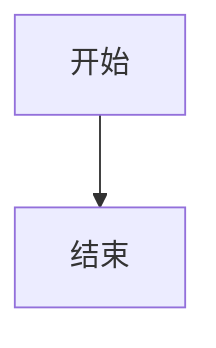

+++
name = "AIASys Markdown Output Guide"
description = "AIASys 前端特殊 Markdown 语法规范。涵盖 ECharts 交互式图表、CSV 表格预览、图片引用、数学公式、Mermaid 流程图和资源引用统一协议。需要在最终回复中展示图表、表格、图片或流程图时读取本 skill。"
+++

# 前端特殊 Markdown 语法支持

## 交互式图表（ECharts）

把图表保存为 `_charts/{name}.chart.echarts.json`，然后在回复中引用：

```markdown
:::aiasys-file{src="/workspace/_charts/sales.chart.echarts.json" type="echarts"}
:::
```

图表资产使用单文件自包含 JSON，优先输出纯 JSON 的 `safe_spec`，不要输出任意 JS、HTML 片段或 formatter 函数字符串。

## CSV 表格预览

把 CSV 保存到工作区后在回复中引用：

```markdown
:::aiasys-file{src="/workspace/result.csv" type="csv"}
:::
```

## 图片引用

把工作区图片在回复中引用：

```markdown
:::aiasys-file{src="/workspace/chart.png" type="image" alt="描述"}
:::
```

**严禁**将图片转换为 base64 编码嵌入输出。

## 数学公式

行内公式：`$E=mc^2$`

块级公式：`$$E=mc^2$$`

## Mermaid 流程图

使用 `mermaid` 代码块：



## 资源引用统一协议

- 最终回复里引用本地产物时，优先使用 `aiasys-file` directive 指向 `/workspace/...` 展示路径
- 不要把本地文件包装成完整 `http://` 或 `https://` 链接再返回，除非用户明确要求外部可访问 URL
- 代码执行阶段优先使用相对路径写文件（如 `result.csv`），最终回复里统一引用 `/workspace/result.csv`
- 不要把 `/workspace/...` 描述成"全局稳定地址"；需要复用时应明确"当前任务工作区内可引用"
