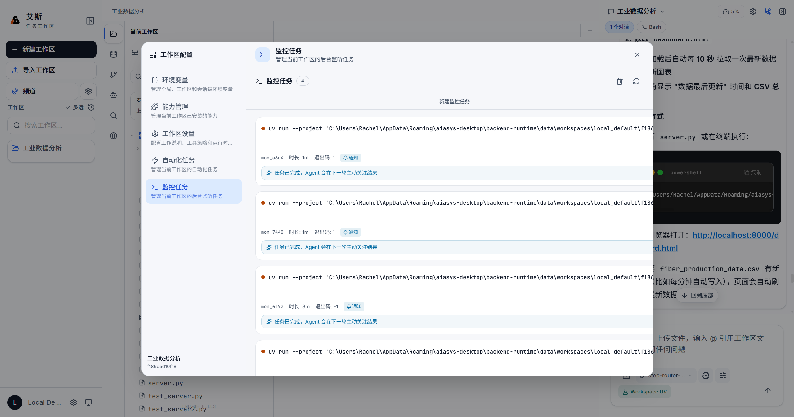

# AutoTask 自动化任务

> 当前版本: v0.4.27

本文档说明 AutoTask 的概念、触发类型、配置方式和运行保护机制。

## 概念

AutoTask 是统一的自动化任务系统，同时支持目标驱动的连续推进和时间触发的定时任务。它替代了早期版本中分散的 Goal 连续推进和 Scheduler 定时调度。

AutoTask 绑定在工作区上，每个工作区可以配置多个 AutoTask。任务的执行结果和日志记录在工作区中。

## 触发类型

AutoTask 支持四种触发类型：

### continuous（连续推进）

持续执行直到目标达成。Agent 拆解目标为可验证的交付物，逐项推进。每次执行完成后判断目标是否达成，未达成则继续下一轮。

典型场景：写一份完整的调研报告、完成一个数据分析项目、逐步实现一个功能模块。

### once（单次执行）

触发一次后执行一轮，完成后自动结束。适合一次性批处理任务。

典型场景：每日数据汇总、定期文件整理、定时备份。

### interval（周期执行）

按固定秒数间隔周期性执行。配置间隔时间后，每隔 N 秒触发一次。

典型场景：监控数据变化、定时健康检查。

### cron（定时调度）

按 Cron 表达式在固定时间点触发。支持标准 5 位 Cron 语法（分 时 日 月 周）。

典型场景：每天早上 9 点发送报告、每周五下午整理周报。

## 会话策略

AutoTask 每次执行时需要绑定一个会话。两种策略：

### 绑定已有会话

复用指定会话的上下文。Agent 在已有会话的基础上继续推进，可以访问之前的对话历史和生成的文件。

适用场景：连续推进任务需要继承之前的上下文。

### 每次新建会话

每次触发时创建新会话，从空白上下文开始执行。每次执行互相独立，不共享历史。

适用场景：定时任务每次执行内容相同、不需要上下文连续。

## 并发策略

当上一次执行尚未完成而新触发到来时，并发策略决定如何处理：

- **skip**：跳过本次触发，等上一次执行完成后再响应后续触发
- **queue**：将本次触发加入队列，上一次执行完成后立即执行
- **parallel**：创建新会话并行执行，不影响当前正在运行的执行

默认策略为 skip。

## 连续推进的完成审计

连续推进（continuous）任务通过完成审计机制判断目标是否达成：

1. Agent 在执行开始前将目标拆解为可验证的交付物清单
2. 每轮执行后检查交付物完成情况
3. 全部交付物完成时，Agent 调用 `auto_task_signal(action="complete")` 发出完成信号
4. 系统收到完成信号后标记任务完成

如果执行过程中需要用户介入（如需要用户提供额外信息、确认关键决策），Agent 会暂停任务并等待用户响应。暂停状态下的任务不会继续消耗执行轮次。

## 运行保护

AutoTask 受多重保护机制约束，防止失控运行：

- **完成信号**：Agent 发出完成信号后任务立即停止
- **最大连续轮次**：continuous 任务有最大执行轮次上限，超过后自动暂停
- **连续错误阈值**：连续执行失败达到阈值后自动暂停，防止反复重试消耗资源
- **手动暂停**：用户可以随时手动暂停任务

暂停后的任务可以手动恢复继续执行。

## 会话预算

AutoTask 与普通对话共享当前会话的 token 预算。预算消耗规则：

- 每次执行消耗的 token 从会话预算中扣除
- 预算耗尽后，当前执行被阻断，绑定的 continuous 任务自动暂停
- 预算充足后可以手动恢复任务

会话预算在会话设置中配置，详见[会话管理](session-management.md)。

## 任务状态管理

每个 AutoTask 维护以下运行状态信息：

- 运行次数：累计触发和执行次数
- 上次运行时间：最近一次执行的开始时间
- 下次运行时间：cron/interval 任务的下次触发时间
- 连续错误数：最近连续执行失败的次数
- 上次错误：最近一次失败的简要错误信息

### 手动操作

对任务可以执行以下操作：

- **立即运行**：无视触发条件，立即执行一次
- **暂停**：暂停任务，暂停后不再响应触发条件
- **恢复**：恢复已暂停的任务
- **编辑**：修改任务的触发条件、会话策略、并发策略等配置
- **删除**：删除任务及其运行记录

## 访问入口

点击左侧 Activity Bar 的"自动化任务"图标，打开 AutoTask 面板。面板中显示：

- 当前工作区的所有 AutoTask 列表
- 每个任务的状态概览（运行中/已暂停/已完成/出错）
- 任务操作按钮（立即运行、暂停、恢复、编辑、删除）

点击"新建任务"创建新的 AutoTask，配置触发类型、会话策略和并发策略。

面板中的任务列表实时更新，运行中的任务会显示当前执行状态。
