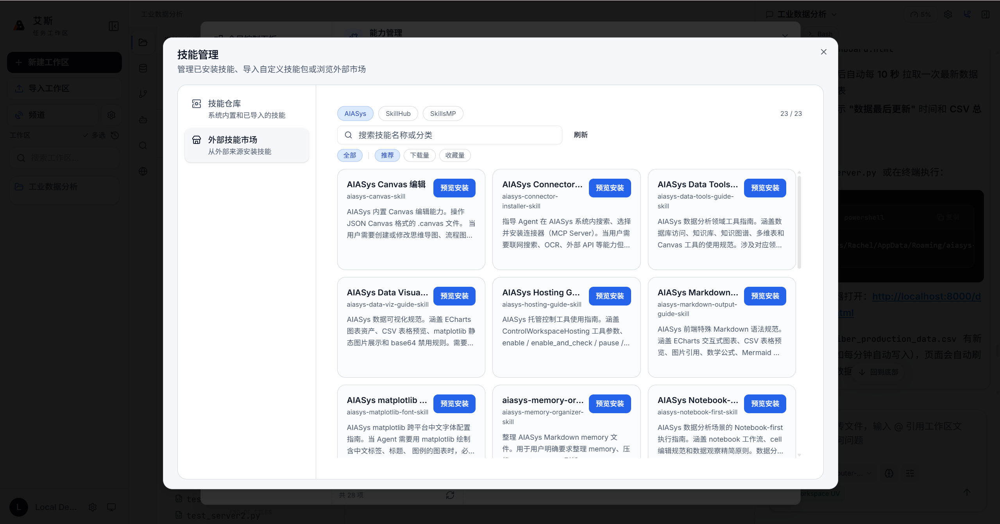
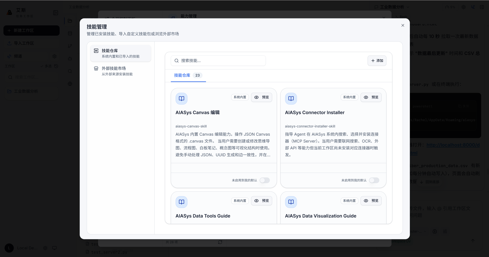

# 能力注册表

能力注册表是系统中所有能力的统一管理层，负责能力的发现、安装、启用和验证。

## 概念

注册表把 Skill 技能、MCP 连接器和协作专家三类能力放在同一个管理框架下，提供一致的操作体验。不管是安装一个 PDF 翻译 Skill，还是接入一个浏览器操控 MCP Server，操作路径和状态语义都一样。

## 能力类型

| 类型 | 标识 | 说明 |
|------|------|------|
| Skill 技能 | `skill_pack` | 特定领域的 SOP 和脚本包，如 PDF 翻译、OCR 提取 |
| MCP 连接器 | `mcp_server` | 外部服务连接器，如浏览器操控、Office 文档操作 |
| 协作专家 | `subagent` | 子 Agent 角色，如代码专家、研究员、审查员 |

## 作用域

| 作用域 | 说明 |
|------|------|
| 工作区级 | 仅在当前工作区可用，安装到 `{ws}/.aiasys/skills/` |
| 全局工作区级 | 跨所有工作区共享，安装到 `global_workspace/.aiasys/skills/` |

## 能力状态

| 状态 | 含义 |
|------|------|
| 可用 | 已安装且通过健康检查，Agent 可以正常调用 |
| 异常 | 已安装但健康检查失败，需要排查配置或依赖 |
| 已禁用 | 已安装但被手动禁用，Agent 不可见 |
| 已安装 | 刚安装，尚未执行健康检查 |
| 可安装 | 在源仓库中存在，尚未安装到当前作用域 |

## 核心操作

### 查看已安装能力

列出当前工作区或全局工作区已安装的能力，每个能力附带健康检查状态。异常的能力会显示失败原因。

### 浏览可安装能力

从内置源（`apps/backend/skills/builtin/`）和用户源（`apps/backend/skills/store/`）列出所有可安装的能力。支持按名称、类型和标签搜索过滤。

### 安装

选择能力后指定目标作用域（工作区或全局），系统将能力从源仓库复制到目标位置。安装过程生成 `.aiasys-skill-meta.json` 元数据文件，记录来源和版本指纹。

### 卸载

删除工作区或全局副本。卸载只删除副本，源仓库中的能力不受影响，可以随时重新安装。

### 启用/禁用

在不解绑的情况下切换能力的可用状态。禁用的能力仍然保留在工作区中，只是 Agent 在运行时不可见。适合临时关闭某个能力，而不需要重新安装。

### 验证

对已安装的能力执行健康检查，确认能力是否真正可用。验证不只是检查文件是否存在，还会测试连接和基础功能。结果直接反映在状态标签上。

### 查看源文件

查看能力的源目录结构和源文件内容，了解能力的实现细节和配置方式。

## 访问入口

左侧 Activity Bar 的"能力管理"图标。面板中按能力类型分三个分类：Skill 技能、MCP 连接器、协作专家。

## 与各能力面板的关系

注册表是统一的底层管理层。MCP 管理面板、Skill 市场面板和专家协作面板是注册表在不同能力类型上的视图。所有安装、卸载、启用、禁用的操作最终都走注册表的统一逻辑，各面板只是展示和交互层面的差异。

