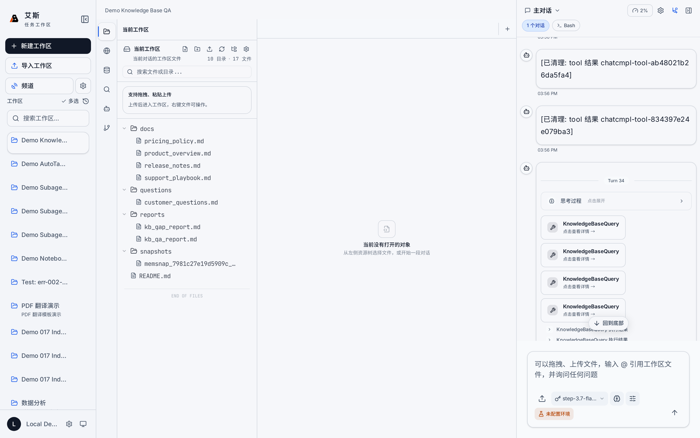

# 知识库

知识库是 AIASys 内置的文档检索系统，基于 SQLite 本地存储，不依赖外部向量数据库。上传文档后自动完成分块、向量化和全文索引，支持混合检索。

## 技术架构

知识库完全基于 SQLite 构建，三个核心组件：

- **FTS5 全文索引**：使用 jieba 分词，支持中文全文搜索
- **sqlite-vec 向量存储**：本地向量存储，无需安装和配置外部向量数据库
- **RRF 融合排序**：Reciprocal Rank Fusion，将全文匹配和向量语义搜索的结果合并排序

这种设计意味着知识库是一个普通文件，可以随工作区一起复制、备份、移动，不需要独立的数据库服务。

## 创建知识库

两种入口：

1. **资源面板**：左侧 Activity Bar 点击"资源"图标，在资源面板中选择"知识库"，点击"新建知识库"
2. **知识库对话框**：在对话输入区通过 Agent 工具创建，Agent 会自动调用知识库管理接口

创建时需要输入知识库名称。每个知识库有独立的文档集合和索引，不同知识库之间数据完全隔离。

## 上传文档

在知识库详情页点击"上传文档"按钮，选择本地文件。支持的格式：

- PDF（`.pdf`）
- Markdown（`.md`）
- 纯文本（`.txt`）

上传后系统自动执行以下处理流程：

1. **分块**：将文档按段落和语义边界切分为文本块，每块大小适中，保证检索精度
2. **向量化**：使用 embedding 模型将每个文本块转为向量，存入 sqlite-vec
3. **全文索引**：使用 jieba 分词后写入 FTS5 索引

处理完成后，文档状态变为"已就绪"，可以被检索。

## 检索策略

知识库检索采用三路融合：

### 1. FTS5 全文匹配

基于 jieba 中文分词的全文搜索。适合精确关键词匹配、专有名词查找、数字和代码片段搜索。

### 2. sqlite-vec 向量语义搜索

基于文本块向量表示的语义相似度搜索。适合模糊语义查询、近义词匹配、概念检索。即使查询词和文档用词不同，也能找到语义相关的内容。

### 3. RRF 融合排序

将全文匹配和向量搜索的结果按 RRF 算法合并。每条结果在各自排序列表中的排名被转换为分数，两个分数加权求和后重新排序。这种融合方式避免了单一检索方式的偏差，兼顾精确匹配和语义相关性。

### maxSpread 多样性过滤

在 RRF 融合之后，系统对结果进行 maxSpread 多样性过滤：当多个结果在语义空间中过于接近（向量距离低于阈值）时，只保留得分最高的一条，丢弃其余近似重复的结果。这个步骤防止返回一堆几乎相同的文档片段，让检索结果覆盖更多不同的信息点。

## 多知识库管理

系统支持创建任意数量的知识库：

- 每个知识库有独立的文档集合、索引和向量存储
- 不同知识库之间的数据完全隔离，互不干扰
- 在知识库列表中可浏览所有已创建的知识库
- 点击知识库进入详情页，查看文档列表、上传新文档、删除已有文档

删除知识库会同时删除该库的所有文档、索引和向量数据。

## 资源面板展示

知识库在左侧 Activity Bar 的资源面板中以资源节点形式展示。点击节点可直接预览知识库的基本信息和文档列表，不需要切换到专门的知识库管理页面。

## 结构化数据入库路径

如果数据存储在数据库中（如 DuckDB 查询结果），推荐的入库流程：

1. 在数据库查询页面执行 SQL 查询
2. 将查询结果导出为工作区文件（CSV 或 Markdown）
3. 将导出的文件上传到知识库

这样知识库就能对结构化数据进行语义搜索，而不需要直接连接数据库。

## Agent 工具

Agent 可以通过系统内置工具完成以下知识库操作：

| 操作 | 说明 |
|------|------|
| 创建知识库 | 新建知识库，指定名称 |
| 更新知识库 | 修改知识库名称或配置 |
| 上传文档 | 上传文件到指定知识库，自动触发处理流程 |
| 列出文档 | 查看知识库中的所有文档及其状态 |
| 删除文档 | 从知识库中删除指定文档 |
| 查询内容 | 对知识库执行混合检索，返回相关文本块 |

Agent 在对话中可以根据任务需要，主动创建知识库、上传文档并检索内容，无需用户手动操作。

## 使用场景

- **论文调研**：将多篇 PDF 论文导入知识库，用自然语言检索相关段落
- **项目文档**：将项目文档、会议记录、设计文档导入，随时查询
- **知识沉淀**：将多次会话中积累的信息整理上传，形成可检索的知识资产
- **跨文档问答**：对多个相关文档同时提问，系统从不同来源检索并综合回答
