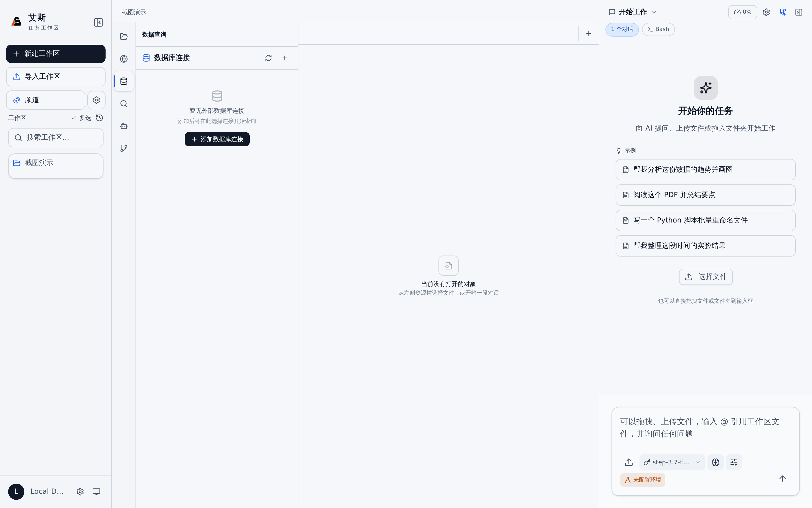

# 数据库查询

AIASys 内置数据查询面板，支持 DuckDB 和外部数据库的 SQL 查询。查询结果可以直接传递给 Agent 作为分析上下文。



## 打开数据查询面板

点击左侧 Activity Bar 的"数据查询"图标（数据库图标），主画布加载数据查询面板。

面板采用三栏布局：

```
左侧 Schema 树 | 右上 SQL 编辑器 | 右下查询结果
```

- 左侧 Schema 树：浏览数据库、表和列结构
- 右上 SQL 编辑器：编写和执行 SQL
- 右下查询结果：表格形式展示查询结果

面板左右分隔线可拖拽调整宽度。


## 内置 DuckDB

DuckDB 是系统内置的分析型数据库，无需任何配置即可使用。

- 默认连接到内存中的 DuckDB 实例，每次查询在独立会话中执行
- 支持标准 SQL 语法（SELECT、WHERE、GROUP BY、JOIN、窗口函数等）
- 支持直接查询 CSV、Parquet、JSON 文件：`SELECT * FROM '/workspace/data.csv'`
- DuckDB 实例随工作区生命周期存在，工作区切换时实例重置

## 外部数据库连接

### 配置连接

在工作区设置中进入"数据库连接管理"，点击"添加连接"：

1. 选择数据库类型（PostgreSQL 等）
2. 填写连接参数：主机、端口、数据库名、用户名、密码
3. 点击"测试连接"验证配置
4. 测试通过后点击"保存"

### 切换数据源

SQL 编辑器顶部的数据源选择器中列出所有可用连接：

- 内置 DuckDB（始终可用）
- 已配置的外部数据库连接

选择数据源后，Schema 树和 SQL 编辑器自动切换到对应数据库。查询在选中数据源上执行。

## SQL 查询

### 编写查询

在 SQL 编辑器中输入 SQL 语句，支持：

- 语法高亮
- 自动补全（表名、列名、SQL 关键字）
- 多语句编辑

### 执行查询

点击编辑器右上角的"执行"按钮或按 `Ctrl+Enter`。支持两种执行模式：

- 执行全部：运行编辑器中的所有 SQL 语句
- 执行选中：只运行选中的文本（适用于编辑器中有多条语句时只执行其中一条）

### 查询结果

SELECT 查询结果以表格形式展示在下方结果面板：

- 列头显示列名和数据类型
- 支持按列排序（点击列头）
- 支持分页浏览（大数据集时）
- 行数超过显示上限时自动截断，显示总行数和已显示行数

### 写入操作

INSERT、UPDATE、DELETE 等写入操作执行后不显示表格，而是显示执行摘要：

- 受影响的行数
- 执行耗时
- 错误信息（如果执行失败）

## Schema 浏览器

左侧 Schema 树以树形结构展示当前数据源的结构：

```
数据库名
  ├── schema1
  │   ├── table1
  │   │   ├── column1 (VARCHAR)
  │   │   ├── column2 (INTEGER)
  │   │   └── ...
  │   └── table2
  └── schema2
```

- 点击表名旁边的展开箭头查看列定义（名称和类型）
- 点击表名自动在 SQL 编辑器中生成 `SELECT * FROM <table> LIMIT 100`
- 右键表名可以快速生成常用查询模板（SELECT 全部列、COUNT、GROUP BY 模板）

## 查询结果作为会话上下文

查询结果可以传递给当前会话的 Agent：

- 在结果面板顶部点击"发送到 Agent"按钮
- 系统将查询结果的摘要（列名、行数、前 N 行数据）追加到当前会话上下文
- Agent 可以基于这些数据进行分析、绘图或进一步处理

发送到 Agent 的数据格式为 Markdown 表格，Agent 可以直接读取。


## 数据库文件支持

除了通过数据源选择器连接，以下数据库文件可以直接从文件树打开：

- SQLite 数据库文件（`.db`、`.sqlite`）：双击打开预览面板，显示表列表和行数
- DuckDB 数据库文件（`.duckdb`）：双击打开预览面板

从文件树打开的数据库文件以只读模式预览。如果需要执行 SQL 查询，需要在数据查询面板中将该文件路径注册为数据源。

## 运行时数据库连接

在会话执行过程中，Agent 可以创建临时的数据库连接句柄：

- 会话级连接：只在当前会话中有效，会话结束后自动关闭
- 适用于 Agent 在执行任务过程中需要查询数据但不希望持久化连接的场景
- 运行时连接不会出现在数据源选择器中，仅在 Agent 工具调用中使用
